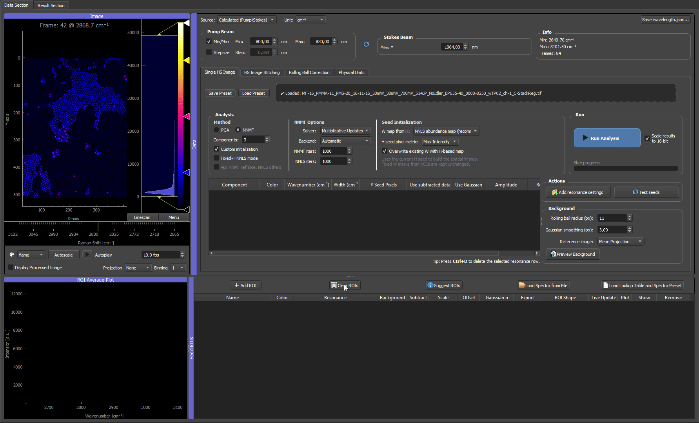
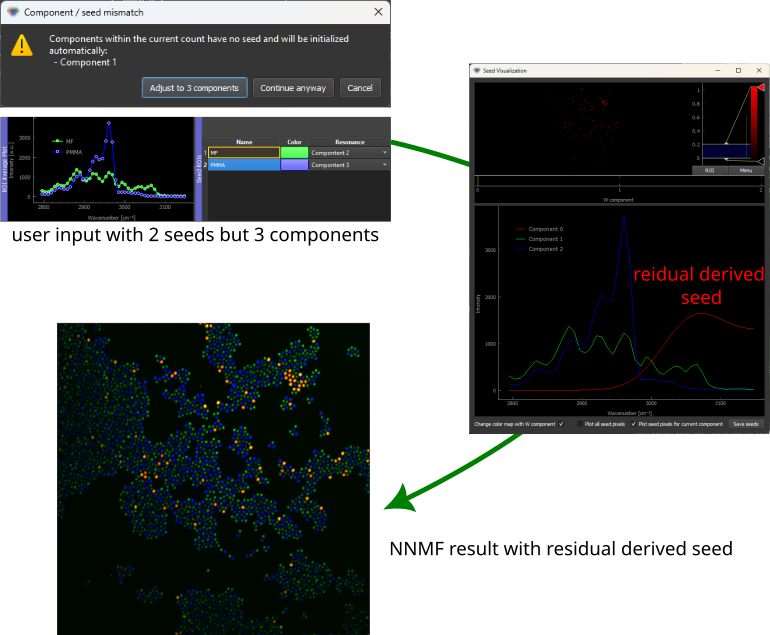
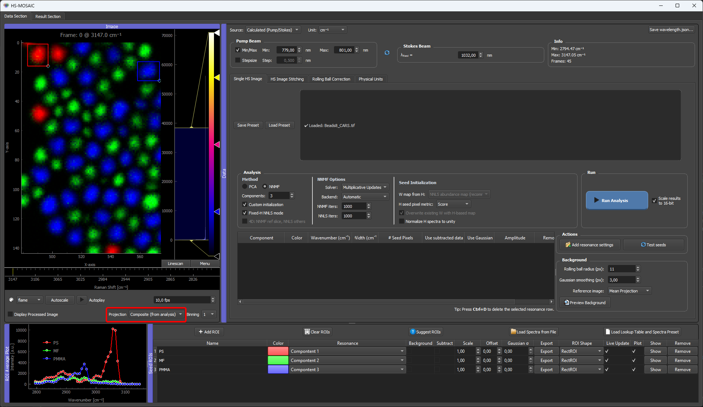
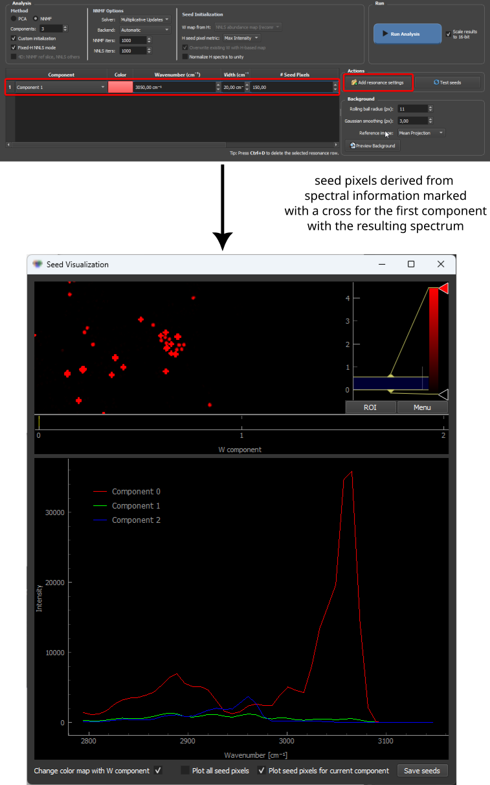
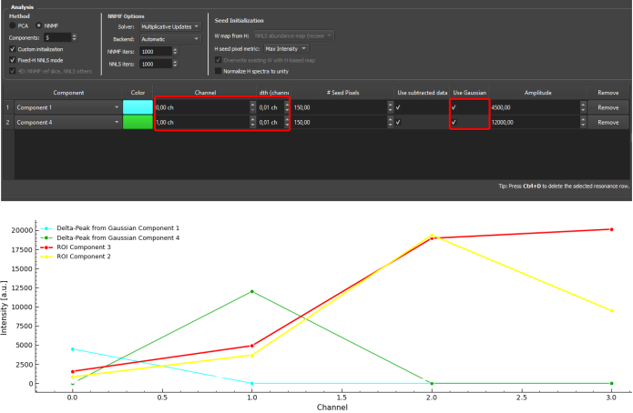
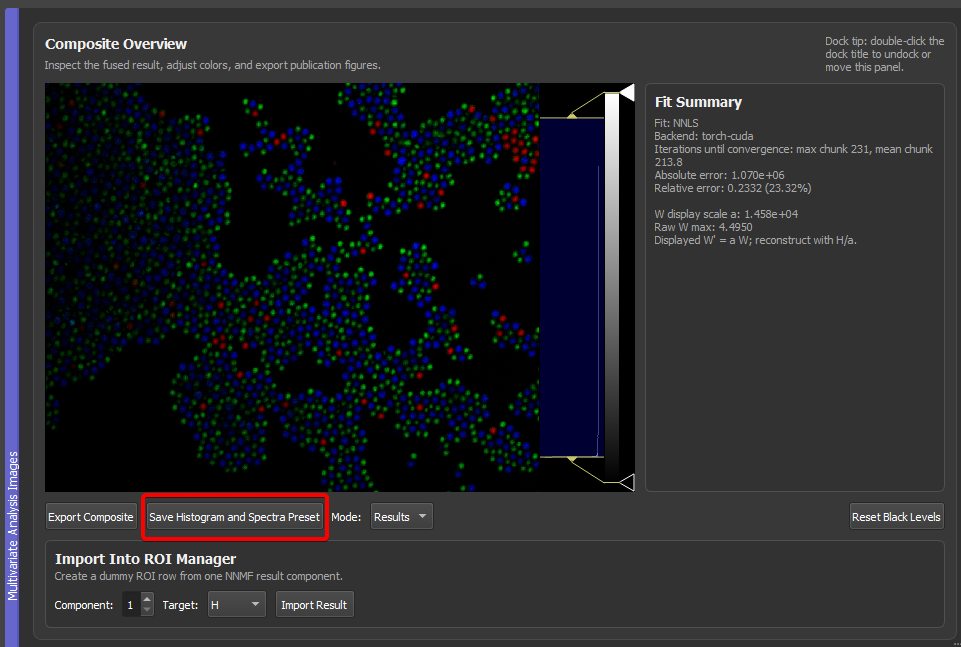
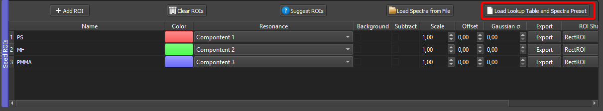

# Essentials

Seven features that are easy to miss when you just click around, but that change how productive HS-MOSAIC is once you know them. Each section is a TL;DR with a screenshot or GIF and a link into the full documentation.

!!! tip "If you read only one page in this docs site, this is the one."
    These items try to guide you to find the best seeds for your data, consequently the best results, as quickly as possible!
    These seven items account for the vast majority of "why didn't I know about this earlier?" feedback. Each one of them is a multiplier on the time you spend in the GUI. Skim the headlines, then come back to the sections that match what you actually do.

---

## 1. Placing ROIs three different ways

ROIs are the main way to give the analysis a starting point. There is more than one way to place them, and you can mix them in the same session.

- **Manual, scrolling through the stack.** Step the channel slider through the spectral axis, identify a channel where a structure is bright, draw a rectangular ROI on it. Quick and unbeatable when you already know what you are looking for. Look out for distinct structures that are bright in different channels — they make the best seeds.
- **Auto-suggested ROIs.** The **Suggest ROIs** button scans the stack for bright structures and groups them by spectral similarity. Useful as a first pass on unfamiliar data, or to fill out the table after one manual ROI is already placed. See [Auto-suggested ROIs](tutorials/03c_suggest_rois.md).
- **Draw on a projection image.** The raw image viewer's **Projection** dropdown (`Average`, `Max`, `Min`) collapses the spectral stack into one image so faint structures become visible. ROIs drawn on the projection still pick up the full per-channel spectrum of the underlying pixels.

→ Full reference: [Seeds, spectra, and W maps](tutorials/03_seeds_spectral_and_spatial.md) · [ROI Manager in detail](tutorials/03b_roi_manager.md)

---

## 2. Residual data analysis — let the GUI find what you missed

If the component count is set higher than the number of seeded spectra, the missing components are filled automatically from the data residual (the part of the signal that is not yet explained by the existing seeded H rows). This is how you let the analysis tell you that there is *something else* in the data that you have not yet identified.

Typical use: seed the components you know, raise the component count by one or two, run the analysis, look at the extra component's spectrum and map.

*The residual-derived component appears alongside the seeded components, with its own spectrum and W map — both pointing to a real but previously un-seeded signal.*

→ Full reference: [Missing H seeds and residual fallback](tutorials/03_seeds_spectral_and_spatial.md#missing-h-seeds-and-residual-fallback)

---

## 3. Composite projection — verify, and find what is missing

The raw image viewer has a **Projection** mode called **Composite (from analysis)** that mirrors the false-colour composite from the result viewer in real time. It is the fastest way to check an analysis result without flipping windows.

Three uses:

- **Verification.** When ROI boxes drawn on the mirrored composite take on the same colour as their dominant component, the unmixing has separated those objects cleanly.
- **Spot new structures.** A structure that emerges in the composite (e.g. from residual analysis) can be ROI-seeded directly on the mirror.
- **Spot missing structures.** A structure that is bright in the raw stack but stays **dark** in the mirrored composite is *not* explained by any current component — clear evidence that a component is missing.

→ Full reference: [Composite Projection In The Raw Image Viewer](tutorials/05_results_and_export.md#composite-projection-in-the-raw-image-viewer)

---

## 4. W-seed mode and downsample — control how strongly components separate

Once you have H seeds, two settings decide how the **spatial** maps come out. They are easy to skip past, but they are the most consequential controls after the seeds themselves: how aggressively the analysis separates components, and how clean the maps are.

**W-seed mode** (the **W map from H** dropdown in Seed Initialization) sets the *degree of separation*, from most aggressive to softest:

| Mode | Behavior | Use when                                                                                                                                         |
|---|---|--------------------------------------------------------------------------------------------------------------------------------------------------|
| **NNLS abundance** (default) | Most specific. A full non-negative least-squares fit per pixel, pushing toward maximum unmixing and near-binary maps. | Chemistries live in **different pixels** (spatially separable) or a strong bias for one component is desired.                                    |
| **Selective score** | Softer. Favors the target spectrum but does not force one winner per pixel, so pixels can carry several components. | Components **share pixels** by design (co-localized signals, fluorophore mixtures) or when `nnls` causes artifacts                               |
| **H-weighted average** | Softest and most robust. Builds the map as a per-pixel average of the spectrum, weighted toward the channels where the seed spectrum is strong. No per-pixel competition, so it never over-separates, but it does not truly unmix either. | NNLS is unstable, or the spectra overlap so strongly that per-pixel fitting is unreliable and a smooth, robust intensity-like map is preferable. |

**W-seed downsample** (Analysis Performance column, default **4**) sets how *smooth* the seed is. It is crucial for **strongly overlapping spectra**, where the per-pixel NNLS seed is noisiest: downsampling denoises the seed so NNMF converges to a smoother, less speckled result. Keep it moderate (2–4); too high produces blocky artifacts that the fit cannot fully undo.

*If the maps look over-separated, the W-seed mode is the first knob to flip; if a strongly overlapping result looks speckled or grainy (see above), the W-seed downsample is the second.*

→ Full reference: [W-seed modes](tutorials/03_seeds_spectral_and_spatial.md#w-seeds-spatial-information) · [Smoothing the W seed (downsample)](tutorials/03_seeds_spectral_and_spatial.md#smoothing-the-w-seed-the-w-seed-downsample-factor) · [Picking nnls vs selective_score](methods/nnmf_nnls_modes.md#picking-nnls-vs-selective_score)

---

## 5. Seed pixels — when you know the peak position but the brightest pixel is hard to find

A no-draw seeding option that uses the actual image data. Use it when you know **where the resonance sits on the spectral axis** but you don't want to scroll for the right ROI by hand.

How it works: enter the resonance centre and width for the component in the **spectral-information table** without drawing an ROI. The GUI finds the pixels with the strongest signal inside that resonance range and uses the **mean spectrum of those pixels** as the component's H seed. The seed appears in the ROI manager as a dummy row, the same way a file-loaded spectrum does.

Two ranking metrics, selectable via **H seed pixel metric** in the seed-initialization controls:

| Metric | Picks pixels that are… | Use when |
|---|---|---|
| **Max Intensity** | brightest at the resonance position | the component's peak is the dominant signal at that resonance — most cases |
| **Score** | bright at the resonance **and** spectrally novel compared to the already-seeded components | the resonance is shared with other components, or the residual-based ranking would otherwise re-pick the same pixels for several components |

Practical recipe: when starting from a known peak list (literature values, prior experiments, a single calibration measurement), fill the spectral-info table with one row per component and let seed pixels do the spatial selection. Switch from **Max Intensity** to **Score** if two components keep landing on the same pixels.

*Resonance settings on the left define where in the spectrum to look; the highlighted pixels on the image are the ones picked by the chosen metric; the mean spectrum on the right is what the analysis receives as the component's H seed.*

→ Full reference: [Seed Initialization Controls](tutorials/03_seeds_spectral_and_spatial.md#seed-initialization-controls) · [Missing H seeds and residual fallback](tutorials/03_seeds_spectral_and_spatial.md#missing-h-seeds-and-residual-fallback) (the Score metric and the residual fallback share the same novelty machinery)

---

## 6. Gaussian seeds — when you know the spectrum but the image has no pure pixel

The fully-synthetic counterpart to seed pixels. Use it when even the brightest pixel at your resonance still contains too much overlap from other components for the mean spectrum to be a clean seed — or when no pixel carries the spectrum at all.

Build a **Gaussian dummy seed** by entering a resonance centre and width in the spectral-information table and ticking the Gaussian option. The seed enters the H basis like any other.

Concrete fluorescence case: a fluorophore that only emits in channel 0. Set up a Gaussian centred on channel 0 with a *very small* width (vanishing FWHM). The resulting seed is effectively a delta peak at channel 0 — the right spectral fingerprint for that fluorophore even though there is no purely single-channel pixel to draw an ROI on.

*Two Gaussian dummy seeds (cyan and green) with vanishing width, effectively delta peaks at single channels, sit alongside ROI-derived spectra in the ROI manager. In this example of fluorescence data mixing, 
the component represents a "clean" channel.*

→ Full reference: [Gaussian Resonance Seeds](tutorials/03_seeds_spectral_and_spatial.md#gaussian-resonance-seeds)

---

## 7. Save Histogram and Spectra Preset — reproducibility across FOVs

After you have a finalized analysis on a representative field of view (colors look right, spectra are clean, ROIs are good), press **Save Histogram and Spectra Preset** in the result viewer. The `.preset` file captures:

- the component colors and histogram levels,
- the spectra in use (Results or Seeds, selectable via the mode dropdown),
- the spectral axis at save time.

On the next field of view of the same sample, load it from the ROI Manager via **Load Lookup Table and Spectra Preset** → **LUTs + ROIs**. The spectra come back as **fixed dummy seeds** (no ROI dependence) and are interpolated onto the new dataset's spectral axis if it differs. Run fixed-H NNLS or seeded NNMF and the new FOV is analysed against the exact same spectral basis as the reference — which is what makes results visually and quantitatively comparable.

Analysis settings (solver, backend, iteration limits, fixed-H mode) are **not** in the `.preset` — they live in the main JSON application preset.

→ Full reference: [Save Histogram And Spectra Preset](tutorials/05_results_and_export.md#save-histogram-and-spectra-preset) · [Load Lookup Table and Spectra Preset](tutorials/03b_roi_manager.md#load-lookup-table-and-spectra-preset) · [Presets and reproducibility](tutorials/06_presets_and_reproducibility.md)

---

## Where to go next

**Start here:** work through the [Synthetic quickstart example](examples/synthetic_quickstart.md) next. It runs the shipped synthetic dataset through every analysis mode with illustrated GIFs, and it puts several of the essentials above into action on real clicks: ROI seeding (#1), letting the background fall out of the residual (#2), and verifying the result with the composite mirror (#3). It is the best way to turn these headlines into a workflow you can repeat on your own data.

- [Synthetic quickstart example](examples/synthetic_quickstart.md) — the recommended hands-on follow-up to this page
- [Quickstart](quickstart.md) — minimal end-to-end workflow
- [Analysis modes](tutorials/02_analysis_modes.md) — which of PCA / Random NNMF / Seeded NNMF / Fixed-H NNLS to pick
- [Concepts](concepts.md) — the unmixing model and the role of seeds
- [Workflow checklist](tutorials/07_workflow_checklist.md) — single-page reminder for a publication-grade run
