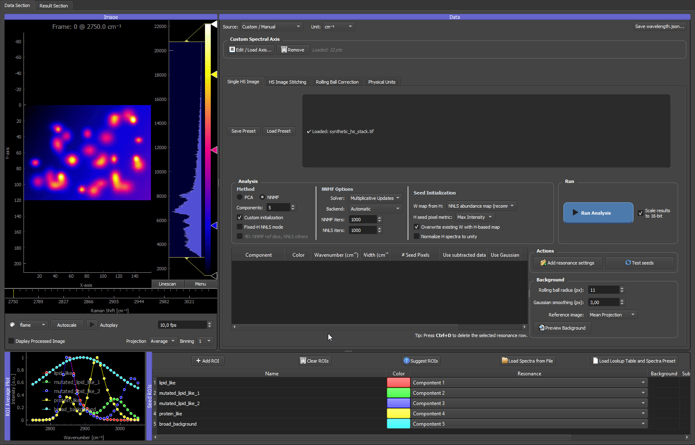

# Synthetic quickstart



*Above: the dataset produced by this example, scrolling through its spectral channels in the GUI.*

This example generates a small, fully reproducible hyperspectral TIFF stack you can use to test installation and learn the full GUI workflow — without any experimental data. It is the canonical "does everything work?" check shipped with HS-MOSAIC.

Use it when:

- you want to confirm that TIFF loading, spectral-axis detection, ROIs, seeds, NNMF/NNLS, and export all work end-to-end,
- you want a safe dataset for learning the workflow before touching real data,
- you need a repeatable dataset for screenshots, GIFs, or bug reports.

## TL;DR

```bash
# 1. generate the data
python docs/examples/generate_synthetic_quickstart.py --output synthetic_quickstart_data

# 2. launch the GUI
hs-mosaic              # or: python -m hs_mosaic

# 3. in the GUI: load synthetic_hs_stack.tif → Load Spectrum from File on the CSV
#                → set Components = 6 → NNMF + Custom init + Fixed-H NNLS mode
#                → Run Analysis
```

The rest of this page explains what the dataset contains, what to expect at each step, and the seed experiments worth trying.

## Synthetic data generation

Run the generator script from an environment where the application dependencies are installed:

```bash
python docs/examples/generate_synthetic_quickstart.py --output synthetic_quickstart_data
```

On Windows, if `python` is not available but the Python launcher is installed:

```bash
py docs/examples/generate_synthetic_quickstart.py --output synthetic_quickstart_data
```

The output folder contains:

| File | Purpose |
|---|---|
| `synthetic_hs_stack.tif` | 3D hyperspectral stack with shape `(channel, y, x)`. |
| `wavelength.json` | Spectral-axis metadata loaded automatically by the GUI. |
| `synthetic_reference_spectra.csv` | One reference spectrum per synthetic component, importable with **Load Spectrum from File**. |
| `README.txt` | Short description of the generated data. |

The default command creates a microbead-like mixture with six spectral components. You can make the field denser or add more mutated lipid-like variants:

```bash
python docs/examples/generate_synthetic_quickstart.py --output synthetic_quickstart_data --beads-per-class 14 --mutant-variants 5 --mutant-beads-per-variant 6
```

Useful generator options:

| Option | Default | Effect |
|---|---:|---|
| `--beads-per-class` | `8` | Number of ordinary lipid-like and protein-like beads. |
| `--mutant-variants` | `3` | Number of mutated lipid-like spectral variants. Each variant shares the lipid peak but has a different tail. |
| `--mutant-beads-per-variant` | `4` | Number of beads for each mutated lipid-like variant. |
| `--seed` | `7` | Random seed for bead positions and noise. |
| `--noise` | `280` | Gaussian noise level added to the stack. |

## What the dataset contains

The default stack has six synthetic components:

| Component | Spatial pattern | Spectrum |
|---|---|---|
| Lipid-like | Several bead-like spots | Narrow peak near 2850 cm^-1 |
| Mutated lipid-like variants | Several smaller bead-like spots per variant | Same main 2850 cm^-1 peak as lipid-like, but variant-specific high-wavenumber tails |
| Protein-like | Several bead-like spots | Main peak near 2930 cm^-1 plus a weaker overlapping peak near 2850 cm^-1 |
| Broad background | Smooth gradient over the field | Broad low-frequency spectral background |

The data are intentionally simple but not perfectly separated. The lipid-like, mutated lipid-like, and protein-like spectra all contribute around 2850 cm^-1, so inspecting only that channel is ambiguous. The mutated lipid-like beads are deliberately artificial cases: they share the lipid peak but have different tails. This makes the dataset look more like a microbead mixture and demonstrates why full-spectrum NNMF/NNLS can distinguish signals that look similar in one channel.

A good multivariate analysis should group ordinary lipid-like beads, separate the mutated lipid-like bead variants, recover protein-like beads, and keep the smooth background as its own component.

## Why seeded NNMF or fixed-H NNLS is useful here

This dataset is designed so that a single bright channel is not enough. Around 2850 cm^-1, several components light up at the same time:

- ordinary lipid-like beads,
- mutated lipid-like beads,
- part of the protein-like signal.

The separation comes from the full spectral shape. The mutated lipid-like variants have the same main lipid peak, but different tails. The protein-like signal partly overlaps with lipid at 2850 cm^-1, but its strongest information is closer to 2930 cm^-1. Seeded NNMF and fixed-H NNLS use these full-spectrum differences instead of treating one channel as one component.

Use **Fixed-H NNLS mode** first if you want a reference result: load the provided spectra and keep them fixed. This shows what the GUI can recover when the spectra are already known.

Then experiment with seeded NNMF by disabling **Fixed-H NNLS mode** while keeping **NNMF** and **Custom initialization** enabled. In this mode, seeds are starting points rather than fixed rules. The result can adapt, which is useful when real reference spectra are approximate or when the sample spectrum differs from the library spectrum.

## Seed experiments to try

| Seed strategy | What to do | What it teaches |
|---|---|---|
| Reference spectra | Load `synthetic_reference_spectra.csv` with **Load Spectrum from File**. | Best controlled starting point; useful for checking the expected separation. |
| Spatial ROIs | Draw ROIs on representative lipid-like beads, mutated lipid-like beads, protein-like beads, and a background region. | Shows how well ROI-derived mean spectra work when you choose representative regions. |
| Gaussian models or seed pixels | Add resonance settings near 2850 cm^-1, 2930 cm^-1, and the mutated lipid tail region around 2985-3035 cm^-1. | Shows how approximate peak knowledge can guide analysis without external spectra. |
| Mixed strategy | Use loaded spectra for known components, then draw or model only the uncertain component. | Mirrors real workflows where some components are known and others need exploration. |
| No seeds / random NNMF | Disable **Custom initialization** and run NNMF. | Shows why unguided NNMF can be less stable when components overlap. |

The goal is not only to get one correct answer. Use this dataset to see how seed quality, component count, and fixed-vs-adaptive spectra change the result.

## GUI workflow

1. Start the GUI.
2. In the **Single HS Image** tab, load `synthetic_hs_stack.tif`.
3. Confirm that the spectral axis is loaded from `wavelength.json`.
4. Set **Components** to the number of reference spectra in the CSV. With the default generator settings, use `6`.
5. Click **Load Spectrum from File** in the ROI Manager and select `synthetic_reference_spectra.csv`.
6. Assign the loaded spectra to the matching component numbers if prompted.
7. In the **Analysis** panel, select **NNMF**, keep **Custom initialization** enabled, and enable **Fixed-H NNLS mode** for the first reproducible test.
8. Click **Run Analysis**.
9. Inspect the result viewer:
   - lipid-like components should map bead-like spots with the ordinary lipid spectrum,
   - mutated lipid-like components should map smaller bead-like spots with different tails,
   - the protein-like component should map beads with stronger 2930 cm^-1 signal,
   - the background component should look like a smooth gradient.

For a more exploratory test, disable **Fixed-H NNLS mode** and run seeded NNMF with the same spectra. The H spectra may adapt slightly because seeded NNMF treats seeds as starting points rather than fixed spectra.

To demonstrate the point of the synthetic data, compare the raw channel around 2850 cm^-1 with the NNMF/NNLS component maps. The raw channel lights up many beads at once, while the multivariate result separates ordinary lipid-like beads, mutated lipid-like variants, and protein-like beads by using the whole spectral shape.

## Expected outcome

| Check | Expected result |
|---|---|
| TIFF loading | First channel appears in the raw image viewer. |
| Spectral axis | The x-axis uses Raman-shift values from `wavelength.json`. |
| Spectrum import | One dummy ROI row appears for each reference spectrum in the CSV. |
| Fixed-H NNLS | H spectra stay equal to the imported references. |
| Seeded NNMF | Maps remain similar, but H spectra may adapt. |
| Overlap demonstration | The 2850 cm^-1 channel is ambiguous, but the separated component maps distinguish ordinary lipid-like beads, mutated lipid-like variants, and protein-like beads. |
| Export | **Save H as CSV** and **Export Composite** should both produce usable files. |

The overlap near 2850 cm^-1 is deliberate. It makes the example useful for teaching why the GUI uses full-spectrum fitting instead of assigning components from one bright channel. The mutated lipid-like bead variants are especially useful for screenshots because they are bright and spectrally similar enough to ordinary lipid-like beads that a single-channel view cannot explain them cleanly.

## What to look at if something looks wrong

| Symptom | Likely cause | Fix |
|---|---|---|
| Image opens but spectral axis is in channel indices, not cm⁻¹ | `wavelength.json` was not placed next to the TIFF, or was renamed. | Re-run the generator into a folder that already contains the TIFF, or copy the JSON next to it manually. See [Spectral axis reference](../reference/spectral_axis_and_wavelength_json.md). |
| "Loaded image contains NaN or Inf" warning | Should never appear for the generated stack. If it does, the TIFF was rewritten by another tool. | Re-generate from scratch. |
| Fewer or more bead components than expected | Component count in the **Analysis** panel does not match the CSV. | Set **Components** to the number of rows in `synthetic_reference_spectra.csv` (default 6). |
| Composite map looks all-cyan or all-grey | A background or fixed-W ROI dominates the display, or all components share the same colour. | Open the ROI manager, give each component a distinct LUT colour, and hide the background component for visual checks. |
| Fixed-H NNLS maps look much grainier than seeded NNMF | This is expected behaviour, not a bug. | See the explanation in [Analysis modes – Fixed-H NNLS](../tutorials/02_analysis_modes.md#fixed-h-nnls). |
