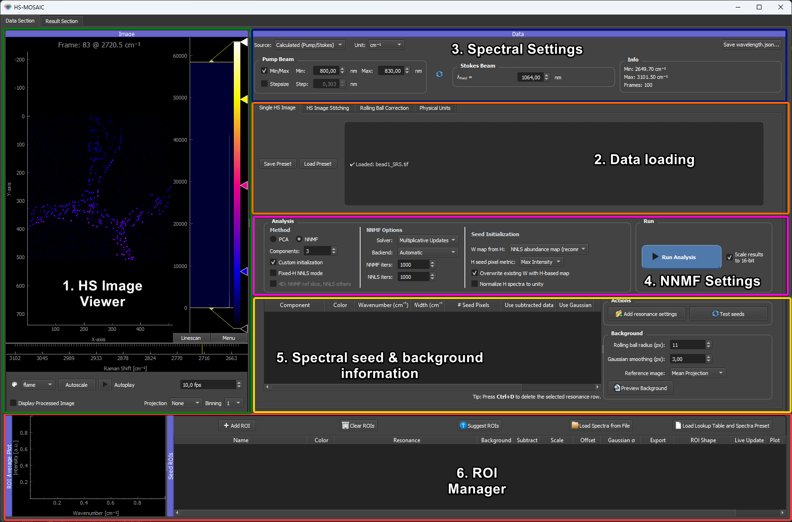

# HS-MOSAIC Documentation

Welcome to the documentation for HS-MOSAIC (HyperSpectral Multivariate Optical Analysis Components), a desktop GUI for fast unmixing and reconstruction of hyperspectral and multispectral imaging data.
This documentation is designed to guide users through the installation, usage, and troubleshooting of the software, as well as provide detailed tutorials and reference materials.

Quick Demo of the main workflow:

## Start Here

- [Standalone Windows .exe](standalone_windows.md)
- [Full Python installation](installation.md)
- [Quickstart](quickstart.md)
- [Concepts](concepts.md)
- [Troubleshooting](troubleshooting.md)
- [Citation](citation.md)

## Tutorials

The tutorials explain the app from the basic workflow upward. They are intentionally modality-independent first; dataset-specific examples are listed separately below.

### GUI basics

Here you learn everything about the GUI and particularly the pyqtgraph plotting library, which is used for all interactive plots in the app. This is important to understand how to interact with the plots and how to interpret the visualizations.

- [GUI and pyqtgraph basics](tutorials/00_gui_and_pyqtgraph_basics.md)

### 01 Data loading

Here you learn how to load different data formats to the GUI. An important prerequisite is the tiff file format.
The app can load both 3D TIFFs (x/y/spectral) and 4D TIFFs (x/y/z/spectral or x/y/time/spectral). The app also supports loading tile folders containing multiple TIFFs that together form a larger image.

- [Loading 3D TIFF and 4D data](tutorials/01_loading_data.md)
- [Spectral axis and channel labels](tutorials/01a_spectral_axis_and_channel_labels.md)
- [Stitching tile folders](tutorials/01b_stitching_tile_folders.md)

### 02 Analysis

To understand the concepts of multivariate analysis, it is essential to understand the different analysis modes and how they work. This section explains the different modes and how to use them.
The overview can help in particular to find better seed spectra for the NNMF and NNLS modes (see [Seeds, spectra, and W maps](tutorials/03_seeds_spectral_and_spatial.md)), which can be crucial for getting good results.

- [Analysis modes](tutorials/02_analysis_modes.md)

The GPU acceleration page outlines how the optional GPU acceleration paths are set up.
It is not essential to understand this for using the app, but it can be helpful for troubleshooting and for understanding the performance of the app.

- [GPU acceleration](tutorials/02a_gpu_acceleration.md)

### 03 Seeds

Seeds are how you steer NNMF and fixed-H NNLS toward physically meaningful results. They can come from ROIs drawn on the image, reference spectra loaded from files, Gaussian resonance models, or the automatic suggester —
the pages below cover each source and how they combine into the H and W matrices the solver receives.

- [Seeds, spectra, and W maps](tutorials/03_seeds_spectral_and_spatial.md)
- [Loading custom seed spectra](tutorials/03a_loading_custom_seed_spectra.md)
- [ROI Manager in detail](tutorials/03b_roi_manager.md)
- [Auto-suggested ROIs](tutorials/03c_suggest_rois.md)

### Remaining workflow

The rest of the tutorial is dedicated to handling results, exporting data, and ensuring reproducibility. This is important for getting the most out of the app and for sharing results with others.

- [Results and export](tutorials/05_results_and_export.md)
- [Presets and reproducibility](tutorials/06_presets_and_reproducibility.md)
- [Physical units and rolling-ball correction](tutorials/04_physical_units_and_rolling_ball.md)
- [Workflow checklist](tutorials/07_workflow_checklist.md)

## Examples

The example section is for complete data-specific workflows. The synthetic quickstart is the canonical end-to-end check for a fresh install; the other pages are planning outlines for upcoming worked examples.

- [Examples overview](examples/index.md)
- [Synthetic quickstart](examples/synthetic_quickstart.md) — runnable end-to-end check
- [Stitching and preprocessing](examples/stitching_and_preprocessing.md) — *WIP*
- [CARS/SRS label-free data](examples/cars_srs_label_free.md) — *WIP*
- [SWIR reflection data](examples/swir_reflection.md) — *WIP*
- [4D fluorescence unmixing](examples/fluorescence_4d_unmixing.md) — *WIP*

## Methods

- [NNMF and NNLS modes](methods/nnmf_nnls_modes.md) — algorithms, math, convergence criteria, and literature references behind the analysis modes.

## Reference

- [Spectral axis and wavelength.json](reference/spectral_axis_and_wavelength_json.md)
- [ROI manager and seed types](reference/roi_manager_and_seed_types.md)
- [Fiji export](reference/fiji_export.md)
- [Presets](reference/presets.md)
