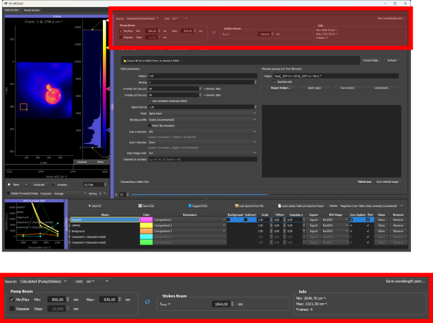

# Spectral Axis and wavelength.json

The spectral axis tells the GUI what each image channel represents. This page is the complete reference for all axis modes and for the `wavelength.json` metadata file.

For a workflow-oriented introduction, see [Spectral axis and channel labels](../tutorials/01a_spectral_axis_and_channel_labels.md).



*Interface for configuring the spectral axis.*

## Axis Modes

The spectral-axis widget has **two independent controls** that work together:

- A **Source** dropdown that decides *how* the channel positions are obtained: **Calculated (Pump/Stokes)** or **Custom / Manual**.
- A **Unit** dropdown with three choices, **cm⁻¹**, **nm**, and **Index**, that decides how those positions are interpreted and labeled. The Unit applies within *both* sources.

So `nm` is a unit, not a separate source mode. The meaningful combinations are described below, with a summary table at the end.

### Source: Calculated (Pump/Stokes)

Use this for a scan where one laser beam is tuned across a range while the other stays fixed (the standard coherent-Raman acquisition, but also any plain wavelength scan). You enter the **scan range**, not per-channel values:

- tuned wavelength minimum (nm),
- tuned wavelength maximum, or a step size (nm),
- fixed beam wavelength (nm), used only for the Raman calculation,
- which beam was tuned (pump or Stokes), toggled with the swap button.

The number of points always equals the number of image channels. What the GUI does with the range depends on the **Unit**:

- **Unit = cm⁻¹** (Raman): the GUI computes a Raman-shift axis in cm⁻¹ from the tuned range and the fixed beam. This is the right choice for most CRS/CARS/SRS datasets.
- **Unit = nm** (wavelength scan): the GUI ignores the fixed beam and simply produces a **linear wavelength ramp in nm** from the tuned minimum to the tuned maximum, one value per channel. Use this for wavelength-resolved hyperspectral data (fluorescence emission, SWIR, broadband spectroscopy) acquired by scanning a known nm range. You still enter only the min/max (or min plus step), not each channel.
- **Unit = Index**: the axis is plain channel indices (0, 1, 2, ...), ignoring the range entries.

### Source: Custom / Manual

Use this when the channel positions are not described by a single scan range, for example an irregular set of wavelengths or named fluorophore channels. Here you provide the values **per channel**, by loading them (a `wavelength.json`, see below) or entering them manually. A custom axis carries:

- **numeric values**, such as `720, 740, 760`, used as the x-axis positions in spectral plots and for resampling loaded reference spectra. The **Unit** (cm⁻¹ or nm) labels these numbers.
- **text labels**, such as `DAPI, FITC, Cy5`, shown as channel labels.

Numeric values and text labels can be combined: with both present, the plot shows the text labels while still using the numeric positions for interpolation (important when loading external reference spectra). If **only** text labels are provided (no numeric values), the internal axis falls back to channel index and the Unit is forced to **Index**.

### Combination summary

| Source | Unit | What the axis becomes | Typical data |
|---|---|---|---|
| Calculated | cm⁻¹ | Raman shift computed from the tuned range + fixed beam | CRS / CARS / SRS Raman scans |
| Calculated | nm | Linear wavelength ramp across the tuned min/max (fixed beam ignored) | Fluorescence emission, SWIR, broadband wavelength scans |
| Calculated | Index | Channel indices (range ignored) | Quick load with no calibration |
| Custom | cm⁻¹ or nm | The per-channel `custom_values` you load or enter, labeled with that unit | Irregular axes, imported axes, reused `wavelength.json` |
| Custom | Index | Channel indices, optionally with text `custom_labels` | Named fluorophore / filter channels (DAPI, FITC, ...) |

---

## wavelength.json

Place a file named exactly `wavelength.json` in the **same folder** as the TIFF file. When the GUI loads the TIFF, it automatically reads this file and applies the spectral axis.

To write this file from the GUI, configure the spectral-axis widget and press **Save wavelength.json...**. The save dialog opens next to the currently loaded dataset, but the location and file name can still be changed before saving.

### Accepted keys

| Key | Alias | Type | Description |
|---|---|---|---|
| `spectral_unit` | `unit` | string | Spectral unit. Accepted values: `"nm"`, `"nanometer"`, `"nanometers"`, `"wavelength"` → treated as `nm`; `"cm-1"`, `"cm^-1"`, `"1/cm"`, `"cm⁻¹"`, `"wavenumber"`, `"raman"` → treated as `cm⁻¹`; `"index"`, `"indices"`, `"channel"`, `"channels"` → treated as a unitless channel-index axis. |
| `custom_values` | `custom_points` | list of numbers | Numeric axis positions, one per channel. |
| `custom_labels` | `labels` | list of strings | Text labels, one per channel. |
| `tuned_beam` | - | string | Calculated source only (required). `"pump"` or `"stokes"`, depending on which beam was scanned. |
| `fixed_beam_nm` | - | number | Calculated source only (**required**). Fixed laser wavelength in nm. Used for the Raman (cm⁻¹) calculation; ignored when the unit is nm, but the loader still expects it to be present. |
| `tuned_min_nm` | - | number | Calculated source only. First tuned wavelength in nm. |
| `tuned_max_nm` | - | number | Calculated source with min/max input. Last tuned wavelength in nm. |
| `tuned_step_nm` | - | number | Calculated source with step-size input. Tuned wavelength step in nm (alternative to `tuned_max_nm`). |

For custom/manual axes, provide `custom_values`, `custom_labels`, or both. For calculated axes (whether the unit is cm⁻¹ or nm), provide the tuned/fixed laser keys instead, with at least `tuned_min_nm` plus either `tuned_max_nm` or `tuned_step_nm`. Files written from the GUI include the currently active mode.

The number of values or labels must match the number of spectral channels in the loaded image. A mismatch generates a warning and the axis falls back to channel indices.

### Example: numeric wavelength axis

```json
{
  "spectral_unit": "nm",
  "custom_values": [700, 750, 800, 850]
}
```

### Example: dye labels only (channel-index axis)

```json
{
  "custom_labels": ["DAPI", "FITC", "Cy5"]
}
```

This creates a channel-index x-axis and uses the labels for display. If external reference spectra need to be loaded and resampled later, also provide numeric `custom_values`.

### Example: values and labels combined

```json
{
  "spectral_unit": "nm",
  "custom_values": [405, 488, 640],
  "custom_labels": ["DAPI", "FITC", "Cy5"]
}
```

### Example: Raman wavenumber axis with peak labels

```json
{
  "spectral_unit": "cm^-1",
  "custom_values": [2850, 2930, 3000, 3060],
  "custom_labels": ["CH2 sym.", "CH3 asym.", "=CH2", "Phe ring"]
}
```

### Example: labels-only with the `labels` alias

```json
{
  "labels": ["DAPI", "GFP", "mCherry"]
}
```

### Example: calculated Raman axis (pump/Stokes)

Reconstructs a Calculated-source, cm⁻¹ axis from the scan settings. The GUI computes the Raman shift per channel; the number of channels comes from the image.

```json
{
  "spectral_unit": "cm^-1",
  "tuned_beam": "pump",
  "fixed_beam_nm": 1031.0,
  "tuned_min_nm": 800.0,
  "tuned_max_nm": 830.0
}
```

### Example: calculated wavelength ramp (nm)

A Calculated-source axis with the unit set to nm produces a plain linear wavelength ramp from `tuned_min_nm` to `tuned_max_nm` (the fixed beam is ignored but still required to be present). Use this for a wavelength scan such as fluorescence emission or SWIR. `tuned_step_nm` can replace `tuned_max_nm`.

```json
{
  "spectral_unit": "nm",
  "tuned_beam": "pump",
  "fixed_beam_nm": 1031.0,
  "tuned_min_nm": 500.0,
  "tuned_step_nm": 5.0
}
```

---

## Spectral Axis and Preset Interaction

The spectral axis state is saved in the main JSON preset. When a preset is loaded, it restores:

- the source mode (calculated / custom),
- the unit,
- pump/Stokes settings,
- custom values and labels.

If the loaded preset was saved for a different dataset with a different channel count, the GUI warns that the spectral axis may not match the current image. In that case, update the axis manually or reload from `wavelength.json`.

---

## Interpolation for Loaded Spectra

When reference spectra are loaded from `.txt`, `.asc`, or `.csv` files, the loader re-samples them onto the current image spectral axis by linear interpolation. This means:

- the loaded file can have any sampling; the GUI handles axis conversion,
- if the file axis is shorter than the image axis, the loader extrapolates at the edges and logs a warning,
- providing numeric `custom_values` (not just labels) is important if external spectra will be loaded and resampled.

---

## Common Mistakes

**File not detected**: the file must be named `wavelength.json` (lowercase, exact spelling) and placed directly next to the TIFF, not in a subdirectory or parent folder.

**Wrong channel count**: if the JSON has 10 values but the TIFF has 12 channels, the GUI logs a warning and falls back to channel indices.

**Invalid JSON**: trailing commas and unquoted keys are not valid JSON. Use a JSON validator before placing the file.

**Labels-only axis with external spectra**: if only text labels are given and no numeric values, the GUI cannot interpolate loaded reference spectra onto the axis. Provide `custom_values` as well.
