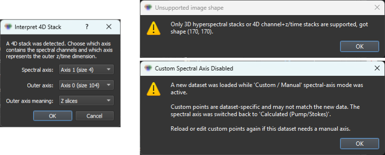

# Troubleshooting

## Qt / GUI startup problems

### Qt platform plugin error

Symptom: the application exits immediately with a message like:

```
qt.qpa.plugin: Could not find or load the Qt platform plugin "windows"
qt.qpa.plugin: Could not find or load the Qt platform plugin "xcb"
This application failed to start because no Qt platform plugin could be initialized.
```

Cause: Qt's platform plugins cannot be located at runtime. This happens when the Conda environment is not activated, when system Qt libraries are missing (Linux), when PyQt5's bundled plugin directory is incomplete or quarantined by anti-virus (Windows), or when a competing Qt installation shadows PyQt5's bundled Qt.

Try these fixes in order — the first applicable one usually resolves it:

#### 1. Confirm the environment is active

Make sure the correct Conda or venv environment is activated before launching. If you opened a new terminal, activation does not carry over.

#### 2. (Linux only) Install the Qt platform system libraries

```bash
# Debian / Ubuntu
sudo apt-get install libxcb-cursor0 libxcb-xinerama0 libgl1-mesa-glx

# Fedora / RHEL
sudo dnf install libxcb xcb-util-cursor mesa-libGL
```

#### 3. (Windows only) Install or reinstall the Microsoft Visual C++ Redistributable

PyQt5's Qt DLLs depend on the **Microsoft Visual C++ 2015–2022 Redistributable (x64)**. Download it from [https://learn.microsoft.com/cpp/windows/latest-supported-vc-redist](https://learn.microsoft.com/cpp/windows/latest-supported-vc-redist) and run the installer. Reboot, then relaunch the GUI.

#### 4. Reinstall PyQt5 and its bundled Qt

If PyQt5's plugin folder was removed by anti-virus, a forced reinstall restores it:

```bash
pip install --force-reinstall --no-cache-dir PyQt5 PyQt5-Qt5 PyQt5-sip
```

#### 5. Point Qt at its bundled plugins explicitly

When the plugin path autodetection fails, set the environment variable to the plugins directory inside your PyQt5 install. Find the path with:

```bash
python -c "import PyQt5, os; print(os.path.join(os.path.dirname(PyQt5.__file__), 'Qt5', 'plugins'))"
```

Set it in the same terminal before launch:

```bash
# Windows (PowerShell)
$env:QT_QPA_PLATFORM_PLUGIN_PATH = "C:\path\printed\above\platforms"

# Linux / macOS (bash / zsh)
export QT_QPA_PLATFORM_PLUGIN_PATH="/path/printed/above/platforms"
```

#### 6. Last resort — install standalone Qt 5.15 manually

If none of the above resolves the error (most commonly on corporate-managed Windows machines or after multiple conflicting Qt installs), install Qt **5.15.x** standalone from the Qt project and point Windows at its DLLs:

1. Download the **Qt Online Installer** from [https://www.qt.io/download-qt-installer-oss](https://www.qt.io/download-qt-installer-oss). The open-source LGPL version is free; you need a free Qt account.
2. In the installer, select **Qt 5.15.2** (or the matching `5.15.x` patch level), and the **MSVC 2019 64-bit** component for your platform. The default install location is `C:\Qt\`.
3. Add Qt's `bin` directory to the Windows **PATH** environment variable so its DLLs are discoverable:
   - Open *Settings → System → About → Advanced system settings → Environment Variables*.
   - Under *User variables*, edit `Path` and add a new entry:
     ```
     C:\Qt\5.15.2\msvc2019_64\bin
     ```
   - Optionally also add `QT_PLUGIN_PATH` as a new user variable pointing at `C:\Qt\5.15.2\msvc2019_64\plugins`.
4. Close and reopen any terminal so the new environment variables take effect.
5. Relaunch HS-MOSAIC.

The PyQt5 version on PyPI is `5.15.x`, so the matching standalone Qt is `5.15.x` (any patch level — 5.15.2 is the most commonly tested). Do **not** mix Qt 6 with PyQt5.

#### Headless / scripted environments

For automated checks (e.g. CI) where no display is available, force the offscreen backend:

```bash
QT_QPA_PLATFORM=offscreen python -m hs_mosaic   # headless test only
```

The GUI will run without a window. This is not a fix for end-user Qt errors — only useful for testing.

### Blank or frozen window on startup

Possible causes:

- A previous session's preset contains a path or state that takes a long time to resolve. Start with `hs-mosaic` (or `python -m hs_mosaic`) without loading a preset automatically.
- Multiple monitors with different DPI settings on Windows can sometimes cause blank windows. Try launching with only one monitor connected.

---

## TIFF loading problems



*Use the gallery to pattern-match the dialog you are seeing, then jump to the matching subsection below.*

### Wrong number of dimensions

Symptom: a message like `Expected 3D or 4D stack`.

Cause: the TIFF is 2D (single image) or has an unexpected number of axes.

Fix: confirm the TIFF was written as a stack with shape `(channels, y, x)` or `(z, channels, y, x)`. Use Python to check:

```python
import tifffile
img = tifffile.imread("your_file.tif")
print(img.shape)
```

### Spectral axis has wrong channel count

Symptom: the spectral axis shows different channel numbers than expected, or a warning appears about channel count mismatch.

Cause: a `wavelength.json` from a previous dataset is still in the folder, or a preset with a different spectral axis was loaded.

Fix:

- Check that `wavelength.json` has the same number of entries as image channels.
- If using a preset, reload the spectral axis from the loaded TIFF rather than the preset.

### 4D axis selection dialog: wrong axes chosen

Symptom: after loading a 4D TIFF, the displayed image looks wrong (e.g., only one channel appears, or the z/time axis shows channels).

Fix: reload the file and select the axes carefully. The spectral axis is the one with the number of wavelengths or channels. The outer axis is the one with the number of z planes or time points. If uncertain, print the array shape from Python first.

### Floating-point or 32-bit TIFF looks flat or over-scaled

Cause: the GUI remaps all non-uint16 inputs to the 0–65535 working range. A float TIFF with values in range 0.0–1.0 is therefore spread across the full 16-bit scale after loading.

This is expected behavior. See [Loading data – data types](tutorials/01_loading_data.md#data-types-and-intensity-handling) for details.

---

## Spectral axis problems

### `wavelength.json` not detected

Cause: the file is not in the correct location or has the wrong name.

Fix:

- Place `wavelength.json` in **exactly the same folder** as the TIFF, not in a parent or subdirectory.
- File name must be exactly `wavelength.json` (lowercase).
- Confirm the JSON is valid: no trailing commas, correct brackets.

For accepted keys and format examples, see [Spectral axis reference](reference/spectral_axis_and_wavelength_json.md).

### Spectral axis appears as channel indices instead of wavenumbers

Cause: no spectral axis metadata is loaded, or the GUI is in channel-index mode.

Fix: open the spectral-axis widget and either:

- enter the pump/Stokes settings for a calculated Raman axis, or
- enter custom numeric values for your channels, or
- provide a `wavelength.json` and reload the TIFF.

---

## Analysis problems

### Analysis produces all-zero or all-identical component maps

Possible causes:

- The image data is all zeros or constant after loading (check the raw image viewer).
- The number of components is larger than the data rank (too many components for the image size or spectral complexity).
- All ROI seeds are in the same image region, so all H seeds look similar.

Fix:

- Reduce the component count.
- Draw ROIs in visually distinct image regions.
- Run PCA first to estimate how many meaningful variance directions exist.

### NNMF is slow

Possible causes:

- Image is large; binning has not been applied.
- The max iteration count is high.
- PyTorch is not installed or GPU is not detected.

Fix:

- Apply spatial binning (2× or 4×) before analysis to reduce pixel count.
- Reduce NNMF max iterations in the analysis settings.
- Install `environment-pytorch.yml` for faster PyTorch-based NNMF/NNLS. See [GPU notes](installation.md#gpu-notes).

### PyTorch / CUDA backend not being used

Symptom: analysis runs but GPU is not active.

Fix:

- Check that the `environment-pytorch.yml` environment is active.
- Run `python -c "import torch; print(torch.cuda.is_available())"`. If `False`, the CUDA-enabled PyTorch build is missing.
- In the analysis panel, check the backend dropdown is set to **Prefer GPU** (the default since v0.9.4). If a v0.9.3 preset stored "Automatic", it loads correctly as "Prefer GPU" since both have always had identical behavior.
- See the [GPU notes](installation.md#gpu-notes) for installation details.

### Seeded NNMF produces a result, but components look wrong

Common reasons:

- Seeds are in overlapping regions; the spectra are too similar to separate.
- The number of components is wrong.
- The W-seed mode does not suit the data.

Steps to improve:

1. Run PCA first to see dominant variance directions and refine the expected component count.
2. Move ROIs to more spectrally distinct regions.
3. Try `nnls` as the W-seed mode if not already selected.
4. After a first NNMF run, import good result components back as seeds for a second run.

### Fixed-H NNLS maps look very grainy

This is expected when the supplied spectra are broad or strongly overlapping. NNLS solves each pixel independently without spatial smoothing, so the result can look noisier than a seeded NNMF result. It is not automatically a worse fit. See [Analysis modes](tutorials/02_analysis_modes.md#fixed-h-nnls) for an explanation.

---

## Preset and reproducibility problems

### Preset loading with mismatched dataset

Symptom: after loading a preset, the analysis panel shows a different number of components, or the spectral axis does not match.

Cause: the preset was saved with a different dataset.

Fix:

- Check the component count in the analysis panel and adjust if needed.
- Reload the spectral axis to match the new dataset.
- Only ROI geometry and seed spectra that match the image size and spectral axis will transfer correctly.

### Preset not found or image path points to missing file

The main JSON preset stores the full path of the original image file. If the file has moved, the path will be stale.

Fix: load the new data file manually after loading the preset. The rest of the preset state (ROIs, seeds, colors) is still applied; only the automatic image loading will fail.

---

## Export problems

### Fiji/ImageJ TIFF opens with wrong LUTs or scale bar

Cause: LUT colors or pixel-size metadata were not set before export.

Fix:

- Set component colors in the ROI manager before export.
- Set the physical pixel size in the **Physical Units** panel.
- Check that **Scale results to 16-bit** is in the expected state before export (see [Results and export](tutorials/05_results_and_export.md#result-data-types-and-w-scaling)).

### Exported TIFF shows wrong pixel size in Fiji

Cause: the pixel size was not updated after binning or after loading a preset from a different dataset.

Fix: open the physical units panel, set the correct pixel size, and re-export.

### PNG export scale bar missing or wrong size

Cause: physical pixel size is zero or was not set.

Fix: enter the correct pixel size in the physical units panel before exporting the PNG.
