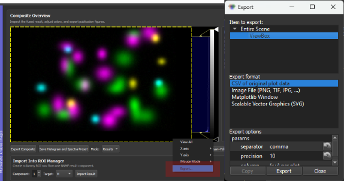
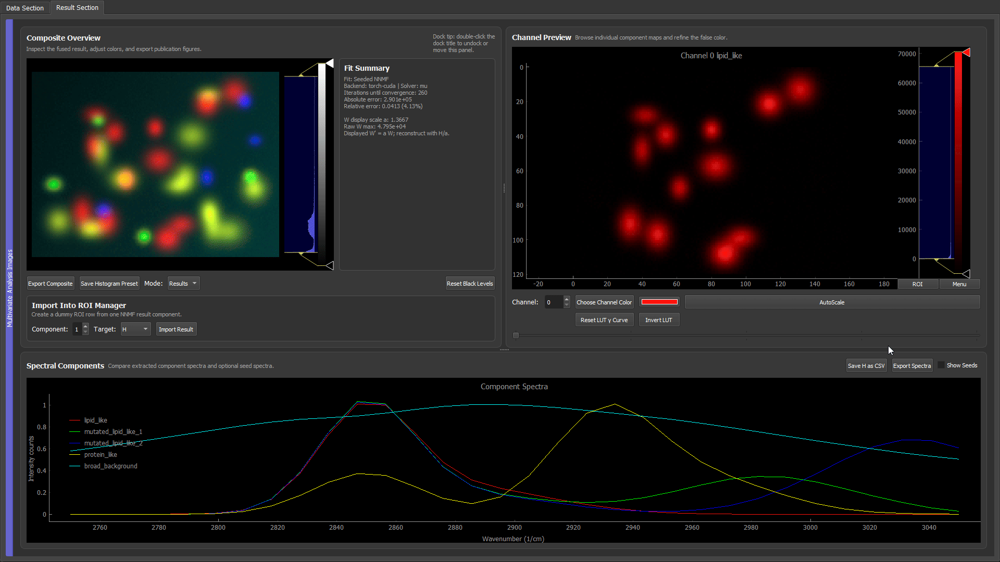
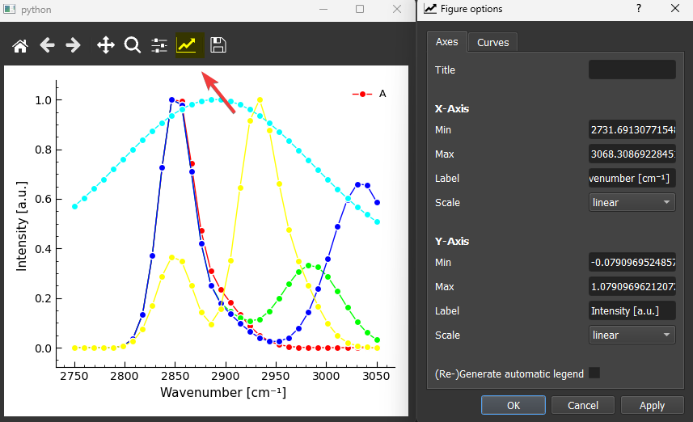
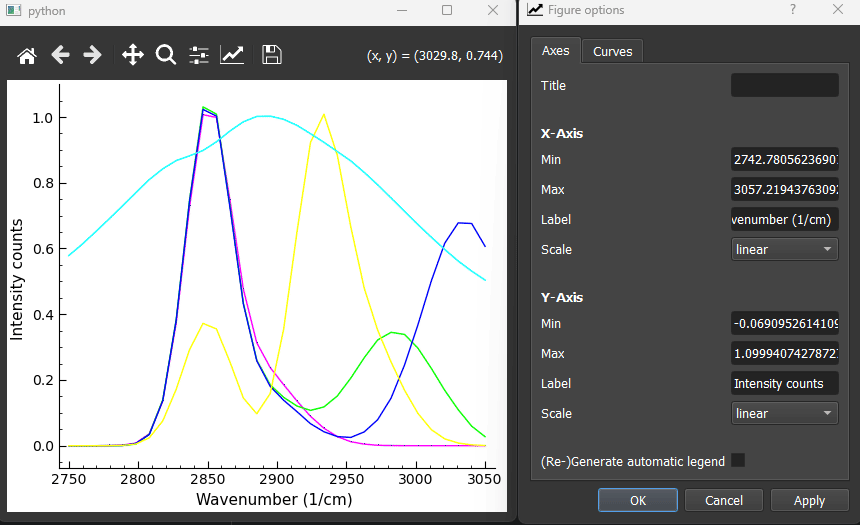

# Publication plots with Matplotlib rc defaults

The GUI uses pyqtgraph for interactive plotting. For quick figures, use **Export Spectra** or **Export Composite** directly in the GUI. For publication figures, it is often better to send a plot to Matplotlib and let Matplotlib handle fonts, line widths, vector export, and final layout.



*Simply right-click any pyqtgraph plot and choose **Export** to for further options*

This page shows how to set useful Matplotlib defaults with a `matplotlibrc` file. The goal is that every Matplotlib figure starts with readable labels, sensible tick marks, and export settings that work for papers and presentations.


## When To Use This

Use the GUI export directly when you need a fast result image, a Fiji/ImageJ-compatible TIFF, or a quick PNG/PDF of the visible plot.

Use Matplotlib export when the figure should be polished further before publication:

| Task | Recommended route | Reason |
|---|---|---|
| Save component maps with LUTs and labels | **Export Composite** | Preserves GUI colors, labels, scale bars, and Fiji metadata. |
| Save numerical spectra | **Save H as CSV** | Keeps the actual component spectra for plotting or analysis elsewhere. |
| Make a fast spectral panel | **Export Spectra** | Exports the visible spectral plot directly as PNG or PDF. |
| Prepare a publication spectral panel | pyqtgraph -> Right-click plot -> **Export** -> **Matplotlib** | Lets Matplotlib control fonts, ticks, line widths, and vector output. |

## Find The rc Location

Matplotlib reads style defaults from a file called `matplotlibrc`. To see which file your current Python environment uses, run:

```bash
python -c "import matplotlib as mpl; print(mpl.matplotlib_fname()); print(mpl.get_configdir())"
```

The first line shows the active rc file. The second line shows the user config directory.

On Windows, a typical user-level location is:

```text
C:\Users\<user>\.matplotlib\matplotlibrc
```

If the file does not exist yet, create it as a plain text file named exactly `matplotlibrc`. Do not save it as `matplotlibrc.txt`.

Use a user-level `matplotlibrc` for your personal plotting defaults. Avoid editing the `matplotlibrc` inside `site-packages`, because that file belongs to the Matplotlib installation and can be overwritten during updates.

## Recommended Publication Default

Paste this into your user-level `matplotlibrc` file:

```ini
# Text and fonts
text.usetex: False
font.family: sans-serif
font.sans-serif: Arial, DejaVu Sans, Liberation Sans
mathtext.fontset: dejavusans

# Figure display and export
figure.figsize: 6.5, 4.2
figure.dpi: 120
figure.constrained_layout.use: True
savefig.dpi: 300
savefig.bbox: tight
savefig.pad_inches: 0.04

# Font sizes
font.size: 11
axes.titlesize: 12
axes.labelsize: 11
xtick.labelsize: 10
ytick.labelsize: 10
legend.fontsize: 9

# Axes frame
axes.spines.top: True
axes.spines.right: True
axes.spines.bottom: True
axes.spines.left: True
axes.linewidth: 0.8
axes.edgecolor: black
axes.xmargin: 0.02
axes.ymargin: 0.04
axes.grid: False

# Lines and markers
lines.linewidth: 1.6
lines.markersize: 4

# Mirror ticks on all sides, but label only bottom and left
xtick.bottom: True
xtick.top: True
xtick.labelbottom: True
xtick.labeltop: False

ytick.left: True
ytick.right: True
ytick.labelleft: True
ytick.labelright: False

xtick.direction: in
ytick.direction: in

xtick.major.size: 5
ytick.major.size: 5
xtick.major.width: 0.8
ytick.major.width: 0.8
xtick.major.pad: 4
ytick.major.pad: 4

xtick.minor.visible: True
ytick.minor.visible: True
xtick.minor.size: 2.5
ytick.minor.size: 2.5
xtick.minor.width: 0.6
ytick.minor.width: 0.6

# Legend
legend.frameon: False
legend.handlelength: 1.8

# Color cycle
axes.prop_cycle: cycler('color', ['tab:blue', 'tab:red', 'tab:green', 'tab:purple', 'tab:orange', 'tab:cyan'])

# Vector export with editable text
pdf.fonttype: 42
ps.fonttype: 42
svg.fonttype: none
```

This style creates a full plot frame, mirrors ticks on the top and right, keeps numeric labels only on the bottom and left, and uses 300 dpi for saved raster images.

## Important Settings

| Setting | Recommended value | Why it matters |
|---|---|---|
| `text.usetex` | `False` | Avoids requiring a full LaTeX installation. Matplotlib mathtext still supports labels such as `cm$^{-1}$`. |
| `figure.dpi` | `120` | Keeps interactive Matplotlib windows readable without becoming oversized. |
| `savefig.dpi` | `300` | Produces publication-quality PNG output. |
| `savefig.bbox` | `tight` | Removes unnecessary whitespace around saved figures. |
| `axes.spines.top/right` | `True` | Draws a full frame around the plot. |
| `xtick.top`, `ytick.right` | `True` | Mirrors ticks on the top and right sides. |
| `xtick.labeltop`, `ytick.labelright` | `False` | Avoids duplicate tick labels. |
| `pdf.fonttype`, `svg.fonttype` | `42`, `none` | Keeps text editable in common vector workflows. |


## Matplotlib Export Workflow

1. Generate or inspect the result in the GUI.
2. Right-click the spectral plot.
3. Choose **Export**.
4. Select **Matplotlib** in the export dialog.
5. Use the Matplotlib window to check labels, line widths, ticks, and limits.
6. Save the final figure as PDF, SVG, or PNG from the Matplotlib toolbar.

For a paper figure, prefer PDF or SVG when the downstream program supports vector graphics. Use PNG at 300 dpi when the figure must be rasterized.



## Edit The Matplotlib Figure Window

After pyqtgraph sends the plot to Matplotlib, the Matplotlib toolbar provides additional interactive controls. The exact icons depend on the Matplotlib backend, but the common buttons are:



| Toolbar control | Use it for |
|---|---|
| Home, back, forward | Return to previous plot views after zooming or panning. |
| Pan | Move the visible plot range interactively. |
| Zoom | Draw a rectangle to zoom into a spectral region. |
| Configure subplots | Adjust margins and spacing if labels are too close to the figure edge. |
| Figure options | Edit axis labels, axis limits, curve labels, line colors, line widths, markers, and legend entries. |
| Save | Export the final figure as PNG, PDF, SVG, or another Matplotlib-supported format. |

The **Figure options** button is especially useful for quick publication cleanup. In the dialog:

- use the **Axes** tab to change the title, x/y labels, limits, scale, and legend settings;
- use the **Curves** tab to change curve labels, line style, line width, marker style, marker size, and color;
- when curve labels or legend entries change, enable **Regenerate legend** and then click **Apply**;
- click **Apply** to preview changes before saving the final figure.

This is useful when the analysis result is correct but the exported plot still needs readable labels, a cleaner legend, thicker lines, or marker sizes that match the target figure panel.



The legend refresh step is easy to miss. If you rename curves, change which lines should appear in the legend, or edit legend-related settings, tick **Regenerate legend** before pressing **Apply**. Without this, Matplotlib may keep the old legend even though the curve settings were changed.


## Common Problems

| Symptom | Likely cause | Fix |
|---|---|---|
| Matplotlib ignores the file | File is named `matplotlibrc.txt` or is in the wrong folder | Re-run the location command and make sure the file is named exactly `matplotlibrc`. |
| The plot opens too large | `figure.dpi` is too high | Use `figure.dpi: 120` and keep `savefig.dpi: 300`. |
| Top/right ticks are missing | rc file or plotting code disables mirrored ticks | Set `xtick.top: True` and `ytick.right: True`; also check for `ax.tick_params(top=False, right=False)`. |
| The top/right frame is missing | plotting code hides spines | Set all `axes.spines.*` values to `True`; check for `ax.spines["top"].set_visible(False)`. |
| LaTeX errors appear | `text.usetex` is enabled without a working LaTeX installation | Use `text.usetex: False`. |
