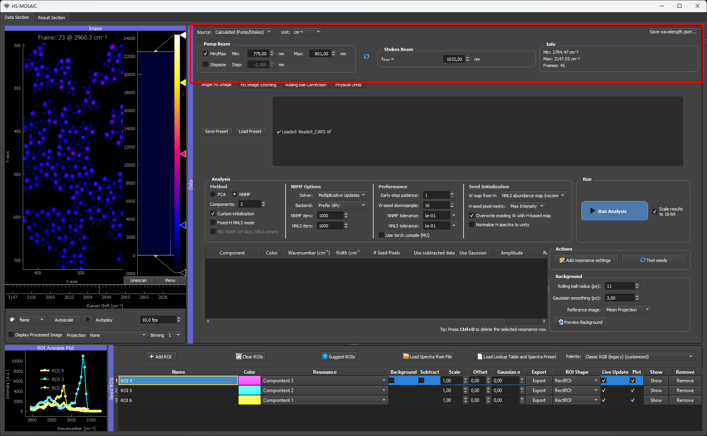
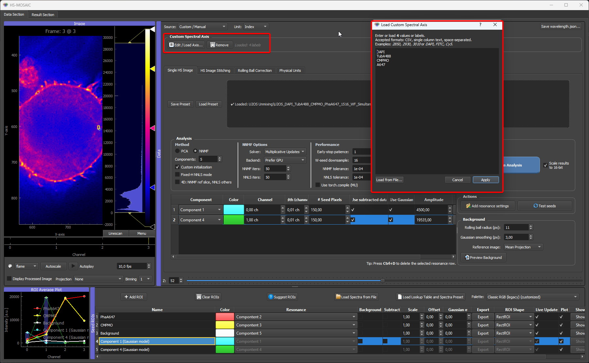

# 01a Spectral Axis And Channel Labels

The spectral axis tells the GUI what each image channel represents. Depending on the experiment, this can be a Raman shift, a wavelength, a channel index, or a custom label such as a dye name.

## Calculated Pump/Stokes Axis

For CRS/CARS/SRS data, the GUI can calculate Raman shifts from pump and Stokes wavelengths.

Use the calculated mode when the spectral stack was acquired by scanning one beam while the other beam stayed fixed.

Inputs:

- tuned wavelength minimum,
- tuned wavelength maximum or step size,
- fixed wavelength,
- which beam was tuned.

The result is a Raman axis in:

```text
cm^-1
```



*Calculated mode on the CARS microbead dataset: the pump/Stokes wavelengths are converted to a Raman-shift axis in cm⁻¹.*

## Wavelength Axis In nm

`nm` is a **Unit**, not a separate source mode. It works with both the Calculated and the Custom source. Switch the Unit to `nm` for wavelength-resolved data such as fluorescence emission, SWIR, or broadband spectroscopy.

- With the **Calculated** source and Unit `nm`, the GUI ignores the fixed beam and builds a plain linear wavelength ramp from the tuned minimum to the tuned maximum (one value per channel). You enter only the scan range, the same min/max (or min plus step) fields as the Raman calculation.
- With the **Custom** source and Unit `nm`, you provide the per-channel wavelength values yourself (loaded or entered), and the axis is labeled in nm.

In both cases the spectral axis is treated as wavelength rather than Raman shift. For the full breakdown of every Source × Unit combination, see [Spectral axis reference → Axis Modes](../reference/spectral_axis_and_wavelength_json.md#axis-modes).

## Manual / Custom Axis

Use the custom/manual mode when the channel positions are not described by a simple pump/Stokes calculation.

The custom axis can contain:

- numeric values, such as `720, 740, 760`;
- text labels, such as `DAPI, FITC, Cy5`.

Numeric values are used as the x-axis values in plots. Text labels are shown as channel labels, and the internal x-axis becomes a simple channel index.



*Custom mode on a multi-channel fluorescence dataset: labels describe the dye captured for each channel and are shown as channel labels, while the internal x-axis becomes a simple channel index. Numeric values can be entered instead (or alongside) when the channels have known wavelengths.*

## wavelength.json

If a file named `wavelength.json` is placed next to the loaded TIFF, the GUI tries to apply it automatically.

To create this file from the GUI, set the spectral axis as needed and press **Save wavelength.json...** in the spectral-axis widget. The save dialog opens in the folder of the currently loaded dataset and can be redirected to another location before saving.

Accepted keys are:

- `spectral_unit` or `unit`.
- `custom_values` or `custom_points`.
- `custom_labels` or `labels`.

Example with numeric wavelengths:

```json
{
  "spectral_unit": "nm",
  "custom_values": [700, 750, 800]
}
```

Example with dye labels:

```json
{
  "custom_labels": ["DAPI", "FITC", "Cy5"]
}
```

Example with values and labels:

```json
{
  "spectral_unit": "nm",
  "custom_values": [405, 488, 640],
  "custom_labels": ["DAPI", "FITC", "Cy5"]
}
```

The number of values or labels should match the number of spectral channels in the loaded stack.

For Raman-shift data, use a wavenumber unit:

```json
{
  "spectral_unit": "cm^-1",
  "custom_values": [2850, 2900, 2950, 3000],
  "custom_labels": ["lipid CH2", "CH stretch", "protein CH3", "high CH"]
}
```

For label-only fluorescence or filter-channel data:

```json
{
  "labels": ["DAPI", "GFP", "mCherry"]
}
```

This creates a channel-index x-axis and uses the labels for display. If external spectra should be interpolated later, provide numerical `custom_values` as well.


## What Is Saved

The spectral-axis state is saved in the main JSON preset. This includes:

- calculated/custom source mode,
- unit,
- pump/Stokes settings,
- custom values,
- custom labels.

When a new dataset is loaded while a custom axis is active, the GUI warns that custom points are dataset-specific and switches back to calculated mode unless metadata are loaded again.
