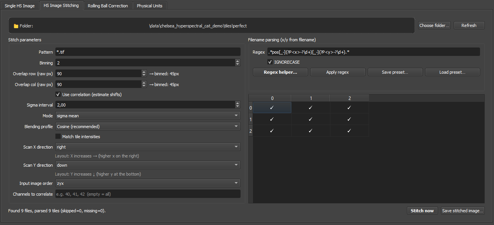
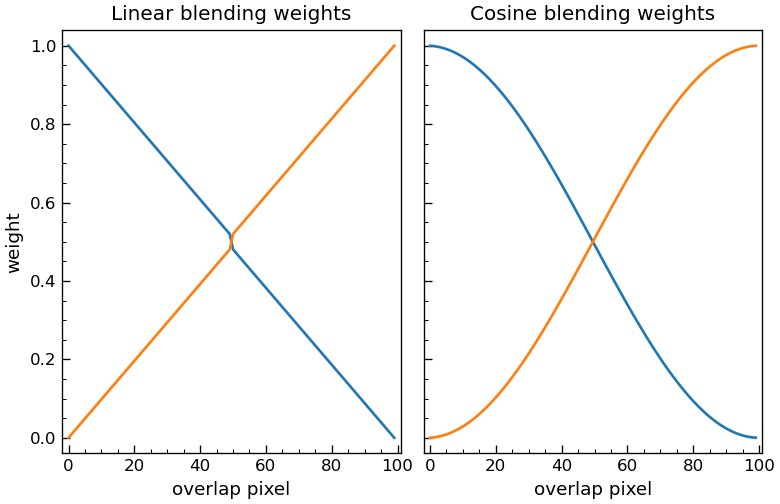

# 01b Stitching tile folders

Use the stitching workflow when one field of view was acquired as a grid of partially overlapping image tiles. The goal is to convert many tile TIFFs into one spectral stack that can be loaded and analyzed like a normal image.

> GIF placeholder: select a tile folder, parse filenames, preview the grid, and stitch.

## Expected input

The stitching tab expects one folder containing tile images. Each tile filename must contain an x and y tile index that can be extracted with a regular expression.

Each tile can be:

- A 2D grayscale image.
- A 3D spectral tile in `zyx` or `cyx` order.
- A 3D tile in `yxc` order.

For hyperspectral or multispectral tiles, choose the correct **Input image order** before stitching. The stitched output is returned in spectral-stack order so it can enter the normal loading and analysis workflow.

## Basic workflow

1. Open the **HS Image Stitching** tab.
2. Choose the tile folder or drag a tile/folder onto the drop area.
3. Set the file **Pattern**, for example `*.tif` or `*CARS*.tif`.
4. Set the filename **Regex** so the table can extract x and y tile indices.
5. Click **Apply regex** and inspect the preview table.
6. Set binning, overlap, scan direction, and input order.
7. Decide whether to use correlation.
8. Click **Stitch now**.
9. Inspect the stitched image.
10. Save the stitched TIFF or continue directly with analysis.

The table preview is the most important diagnostic. If the grid looks wrong before stitching, the stitched image will usually also be wrong.

## When to use stitching

Use the stitching workflow when:

- one field of view was acquired as many partially overlapping tiles,
- the filenames contain stable tile indices,
- the overlap is known approximately from the microscope setup,
- and you want one larger spectral stack before ROI placement or multivariate analysis.

Do not use stitching when the dataset is already one complete TIFF stack, or when the tiles are independent fields of view that should stay separate.

## Pattern vs regex

The **Pattern** filters which files are considered:

```text
*.tif
*THG*.tif
sample_01_*.tiff
```

The **Regex** extracts tile coordinates from the selected filenames. The regex must contain the named groups:

```text
(?P<x>...)
(?P<y>...)
```

These groups tell the program which part of the filename is the x index and which part is the y index.

## Default regex

The default regex is:

```regex
.*pos[_-](?P<x>-?\d+)[_-](?P<y>-?\d+).*
```

This matches filenames such as:

```text
sample_pos_0_0.tif
sample_pos_1_0.tif
sample-pos-2-3.tif
```

Explanation:

- `.*` ignores any text before the tile position.
- `pos[_-]` looks for `pos_` or `pos-`.
- `(?P<x>-?\d+)` captures the x index, including optional negative values.
- `[_-]` accepts `_` or `-` between x and y.
- `(?P<y>-?\d+)` captures the y index.
- `.*` ignores any text after the coordinates.

## Regex examples

For filenames:

```text
tile_x03_y07.tif
```

use:

```regex
.*x(?P<x>\d+)_y(?P<y>\d+).*
```

For filenames:

```text
scanX-1_Y-2_ch0.tif
```

use:

```regex
.*X(?P<x>-?\d+).*Y(?P<y>-?\d+).*
```

For filenames:

```text
xyz-Table[3] - xyz-Table[7].tif
```

use:

```regex
.*xyz-Table\[(?P<y>\d+)\]\s*-\s*xyz-Table\[(?P<x>\d+)\].*
```

Here, the first table index is assigned to `y` and the second to `x`. This is allowed. The important part is that the named groups match the physical tile coordinates.

Use **IGNORECASE** when filename capitalization is inconsistent.

> GIF placeholder: use the regex helper and show the preview table updating.

## Settings reference



The screenshot above shows the three main regions of the panel: stitch geometry + correlation settings on the left, filename parsing + preview table on the right, and run/export actions at the bottom. The table below lists every control in those panels.

| Setting | What it controls | Default | Practical effect |
|---|---|---|---|
| **Pattern** | File-glob filter for which files in the folder are considered. | `*.tif` | Restrict to a subset when the folder mixes modalities, exports, or stray files. If the preview table is empty, check this before debugging the regex. |
| **Regex** | Named-group regex that extracts the `x` and `y` tile indices from each filename. | `.*pos[_-](?P<x>-?\d+)[_-](?P<y>-?\d+).*` | Must contain `(?P<x>...)` and `(?P<y>...)`. See the regex examples earlier on this page. |
| **IGNORECASE** | Whether the regex is case-insensitive. | Off | Enable when filename capitalisation is inconsistent. |
| **Binning** | Spatial downsampling factor applied to every tile before stitching. | `1` | Higher binning is faster and more memory-friendly but loses fine alignment precision. Use `1` when alignment matters; raise it for a quick preview pass. |
| **Overlap row (raw px)** | Expected vertical overlap between vertically adjacent tiles, in raw pixels. | — | The GUI shows the effective binned overlap automatically: ⌊raw / binning⌋. Use the microscope's nominal overlap as a starting point. See [How precise does the overlap value need to be?](#how-precise-does-the-overlap-value-need-to-be) below. |
| **Overlap col (raw px)** | Expected horizontal overlap between horizontally adjacent tiles. | — | Same rules as Overlap row. |
| **Use correlation** | Enable cross-correlation refinement of the geometric tile placement. | On | Use when stage motion has small positioning errors or when the entered overlap is approximate. Disable for clean grids where the overlap is known exactly. |
| **Mode** | How correlation offsets are aggregated: `normal` (per-pair), `mean`, `sigma`, or `sigma mean`. | `sigma mean` | `sigma mean` is the most robust default. See [Correlation settings](#correlation-settings) for the per-mode trade-offs. |
| **Sigma interval** | Confidence interval used by `sigma` / `sigma mean` to reject outlier offsets. | `1.0` | Smaller → reject more offsets as outliers; larger → trust more measured offsets. |
| **Channels to correlate** | Comma-separated list of channel indices used for correlation, e.g. `40, 41, 42`. | empty (all) | Restrict to channels with reliable structure if some channels are noisy, saturated, or flat. |
| **Scan X direction** | Which way higher x indices appear in the displayed mosaic: `left` or `right`. | `left` | If the stitched mosaic is mirrored, change this rather than the regex. |
| **Scan Y direction** | Which way higher y indices appear: `up` (higher y at top) or `down` (higher y at bottom). | `down` | Same logic as Scan X direction. |
| **Input image order** | Axis order inside each tile: `zyx`, `cyx`, or `yxc`. | `zyx` | Use `zyx` / `cyx` for spectral stacks saved frame-first; `yxc` for camera-style multi-channel images. If the stitched channel slider behaves strangely afterwards, this is the first thing to check. |
| **Blending profile** | Weight ramp across the overlap region: `Cosine` or `Linear`. | `Cosine (recommended)` | `Cosine` is C¹-smooth at the seam centre; `Linear` is the legacy triangular tent, kept for comparison with older results. See [Blending](#blending) below. |
| **Match tile intensities** | Per-channel rescaling of each incoming tile to match the running stitch's mean in the overlap region, before blending. | Off | Enable to remove soft brightness steps caused by vignetting or exposure drift. Leave off for quantitative work where absolute tile intensities must be preserved. |
| **Apply regex** | Re-parses the folder against the current `Pattern` + `Regex` + `IGNORECASE` and refreshes the preview table. | — | Press after any change to the parsing fields. |
| **Stitch now** | Runs the full stitching pipeline with the current settings. | — | Only enabled once the preview table looks correct. |

### How precise does the overlap value need to be?

The right strategy depends on whether you know the true overlap accurately:

- **Overlap unknown or approximate** (only the nominal stage value is available). Use **correlation** and enter an overlap that is somewhat *larger* than your best guess (e.g. +20–40 raw pixels). The cross-correlation search is robust enough to find the true shift within an oversized search region, and the extra margin protects you against under-shoot. Erring high in correlation mode is safer than erring low.
- **Overlap known precisely** (calibrated stage or measured directly on a reference tile). Enter the **exact** overlap. With correlation enabled, an oversized overlap then dilutes the score with regions that do not actually correlate, which can pull the estimated shift onto a noise peak. With correlation disabled, the value sets the blend region directly, so accuracy matters even more.

Rule of thumb: *unknown* → overestimate slightly, let correlation refine; *known* → enter the exact value, do not pad.

What happens if it is still wrong:

- too small → duplicated structures or misregistered seams,
- too large → excessive blending and spatial compression,
- too much binning → faster stitching but weaker correlation precision and less sharp seams.

## Choosing grid placement vs correlation

There are two broad strategies:

- grid placement only: place tiles using the parsed x/y grid and the entered overlaps,
- correlation-assisted stitching: estimate small relative shifts from the image content.

Use grid placement only when:

- stage motion is reliable,
- overlap is known well,
- or the tiles have weak internal structure and correlation becomes unstable.

Use correlation when:

- the stage has small positioning errors,
- there is enough texture or contrast in the overlap region,
- and a purely geometric stitch still leaves visible seams or small jumps.

## How the two-pass correlation works

Correlation is applied in **two distinct passes**, not as a single global alignment step. The implementation lives in `contents/cross_correlate.py`; the architecture is the same whether the input is a small grid or a 9 × 9 tile mosaic.

### Why per-pair correlation in the first place

Without per-pair correlation, sub-pixel-to-few-pixel positioning errors accumulate down a column. The wide stitched image often looks fine at first glance because the eye averages over the seams. The artefacts only become obvious in close-up of a single seam:


When two tiles in an overlap region are not aligned and you average them anyway, the result is a doubled or distorted copy of features close to the seam. These are easy to miss in the wide view but unambiguous once you zoom in to the overlap row:


These artefacts motivate the per-tile-pair correlation approach: every vertical neighbour gets its own correlation-based `(y, x)` shift estimate rather than relying on the nominal stage grid alone.

### Pass 1 — per-tile alignment within each column

For every column position, the program walks the tiles top-to-bottom and aligns each pair of vertical neighbours individually using cross-correlation in the overlap region. Each pair gets its own small `(y, x)` shift. Whenever a pair carries an x-offset (the lower tile is a few pixels left or right of the upper tile), the column grows a thin strip of NaN "extension" pixels on the appropriate side so that the cumulative column stays a regular array. These per-tile dynamic offsets are tracked by the `dummy_added` counter in `correct_y_offset`.

The result of running Pass 1 correctly on every tile pair of a real 9 × 9 mosaic — every vertical seam corrected, no doubling artefacts left along any column — is the intermediate state below. Each column is now a rigid stack of vertically-aligned tiles. The column outlines are slightly ragged because every tile pair contributed its own dynamic offset, and the columns are not yet merged across: that is what Pass 2 does next.


### Pass 2 — cross-column alignment

Once every column has been stitched into a single column-image, the same correlation step is applied between adjacent column-images. The function `attach_cols` plus `dummy_correlation` re-runs the correlation core between the right edge of column N and the left edge of column N+1 — internally segment by segment, so that columns with different per-segment dummy padding can still be aligned correctly. The white gaps in the intermediate image close in this pass and the final stitched image emerges.

The two-pass design attacks two distinct error sources in turn: per-tile dynamic offsets in Pass 1 pick up the small drifts inside each column (and prevent the doubling artefacts shown above), and the cross-column pass in Pass 2 picks up the residual drift between columns. The settings in [Correlation settings](#correlation-settings) below control the aggregation strategy that turns the per-pair offsets within a column into one consistent offset.

## Correlation settings

When **Use correlation** is enabled, the program estimates small relative shifts between overlapping tiles. This is useful when the stage coordinates are approximate or the microscope has small positioning errors.

Important settings:

- **Channels to correlate**: leave empty to use all channels, or enter a list such as `40, 41, 42`.
- **Mode normal**: use the individual correlation offsets.
- **Mode sigma**: remove outlier offsets using the sigma interval.
- **Mode mean**: average offsets so a common offset is applied.
- **Mode sigma mean**: remove outliers first, then average offsets.
- **Sigma interval**: controls how aggressively outlier offsets are rejected.

Use a small channel list when only some channels contain reliable structure. Use all channels when the signal is broadly present and stable.

Recommended interpretation:

- `normal`: most direct, least smoothed. Good when the correlation is already stable.
- `mean`: conservative. Good when all overlaps show about the same shift and you want one consistent correction.
- `sigma`: robust against a few bad overlaps, but still keeps local variation.
- `sigma mean`: strongest stabilization. Good default when some overlap regions are noisy or nearly empty.

How to choose `Channels to correlate`:

- leave it empty when most channels show similar morphology,
- restrict it when only part of the spectrum contains clear structure,
- avoid channels dominated by noise, saturation, or flat background.

How to choose `Sigma interval`:

- smaller values reject more offsets as outliers,
- larger values trust more measured offsets,
- if correlation seems unstable, try `sigma mean` first before changing the overlap values.

If correlation makes the mosaic worse, disable it and use grid placement with the current blending settings.


## Blending

Two controls in the stitch dialog decide how the overlapping pixels of adjacent tiles are combined into the final stitched image:

- **Blending profile** (dropdown): `Cosine (recommended)` or `Linear`.
- **Match tile intensities** (checkbox): on/off, default off.

### Blending profile



The weight ramp applied across the overlap region:

- `Cosine` (default): a raised-cosine (Hann) curve. The two weights vary smoothly from ~1/~0 at the seam edges to 0.5/0.5 at the centre and the ramp is C¹ at the midpoint, so the human eye does not pick up the kink that a triangular ramp would leave.
- `Linear`: the legacy triangular tent. Kept available for comparison and backwards compatibility with older results.

In both cases the two weights sum to 1 at every overlap column, so the stitch is a true convex combination of the two tiles.

### Match tile intensities

Each incoming tile can be scaled, per channel, so that its mean intensity inside the overlap region matches the mean of the already stitched image in the same region. This step happens *before* the weighted blend.

When this helps:

- visible soft brightness steps at seams caused by vignetting,
- exposure or laser-power drift between tiles,
- tile-to-tile gain differences in the detector.

When to leave it off (the default):

- quantitative work where the absolute tile intensities must be preserved exactly,
- already flat-field corrected tiles where mean intensities are guaranteed to match,
- single-tile diagnostics, where the rescaling would be a no-op anyway.

Implementation notes:

- The factor is per channel, NaN-safe, and clipped to `[0.1, 10.0]`. A degenerate channel (mean ~ 0 on either side, or any non-finite intermediate) falls back to a factor of 1.0, so the step never invents or kills signal.
- Only the incoming tile is rescaled; the running stitch is never modified by this step. This keeps the result reproducible regardless of the tile order, up to the natural pairwise drift of the rescaling chain.

### How to choose

| Symptom | Try |
|---|---|
| Sharp kink visible at the seam centre | Cosine profile |
| Soft brightness step across the seam | Match tile intensities |
| Both | Cosine + Match tile intensities |
| Need absolute intensity preservation | Cosine + leave matching off |


This example stitches a three-channel multispectral liver dataset from a 9 x 9 tile grid. The workflow first loads a single 512 x 512 px tile to inspect which channels contain useful signal. Channels `0` and `2` are then entered as the correlation channels because they have enough counts for reliable shift estimation. If the channel field is left empty, all channels are used for correlation.

The raw tile overlap is already known in this example, so the overlap values are left unchanged. The stitch is correlation-assisted for every neighbouring tile pair. `Match tile intensities` is not used here; keep it off when the goal is to preserve the measured channel intensities and only enable it for visible tile-to-tile brightness steps.

The same liver tile data is used in [04 Physical units and rolling-ball correction](04_physical_units_and_rolling_ball.md) to show how a shared rolling-ball reference model can be applied to every tile before stitching.

## Saving and reusing stitch settings

The stitching tab has its own JSON preset. This stores:

- Pattern.
- Binning.
- Raw overlap values.
- Sigma interval and mode.
- Scan x/y direction.
- Input channel order.
- Channels to correlate.
- Filename regex.
- IGNORECASE setting.
- Blending profile (cosine / linear).
- Match tile intensities (on / off).

Use stitching presets when the microscope filename pattern and tile geometry are stable across datasets.

This is especially useful when:

- the same microscope saves the same filename scheme every day,
- overlap and scan direction are fixed for one modality,
- or different users should apply the same parsing rules consistently.

## Common problems

If no tiles are parsed:

- Check the file Pattern.
- Check that the regex matches the filename.
- Check that both `(?P<x>...)` and `(?P<y>...)` exist.
- Enable IGNORECASE if capitalization differs.

If the grid is mirrored:

- Change Scan X direction or Scan Y direction.
- Do not swap x and y in the regex unless the table itself shows transposed coordinates.

If seams are visible:

- Check overlap values (overestimate slightly when using correlation, set the exact value when the overlap is known).
- Check binning.
- Try correlation.
- Restrict correlation to structural channels.
- Switch the Blending profile to `Cosine` if it is still on `Linear`.
- Enable `Match tile intensities` if the seam looks like a soft brightness step (typical for vignetting or exposure drift). Leave it off for quantitative work.
- Inspect whether rolling-ball correction or normalization should be applied consistently.

If spectral channels look wrong:

- Check Input image order.
- Check that the tile TIFFs have the expected dimensions.
- Open one tile separately and confirm its channel axis.
