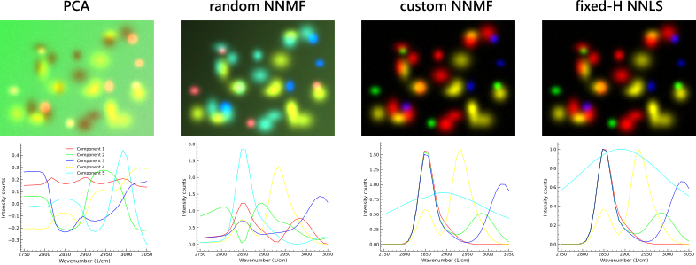
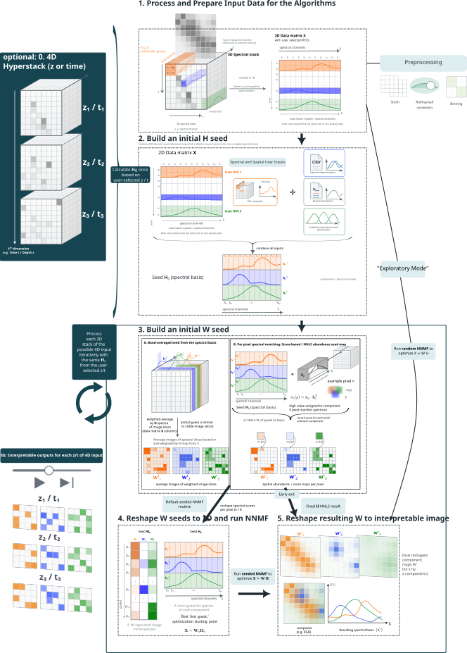

# 02 Analysis modes

This page explains which mode to choose in the GUI and what kind of result to expect. For the mathematical background, see [NNMF and NNLS modes](../methods/nnmf_nnls_modes.md).

## The one-line summary

| Mode | Seeds | Spectra adapt? | Maps adapt? | Best for |
|---|---|---|---|---|
| PCA | none | — | — | First look, artifact check |
| Random NNMF | none | yes | yes | Unguided non-negative exploration |
| Seeded NNMF | H and/or W | yes | yes | Main guided workflow |
| Fixed-H NNLS | H basis | **no** | yes | Stable cross-slice comparison |

The modes form a progression: each one uses more prior knowledge and enforces it more strictly.

*Same dataset, four modes, side by side. **PCA** fails to recover all the blob peaks; **random NNMF** shows severe spectral mixing between components; **seeded (custom) NNMF** and **fixed-H NNLS** produce virtually identical results — here the ground-truth blob spectra were used as seeds, which is the best-case scenario for both. Cyan component 5 represents the background and is hidden in every panel so the separated blobs stay visible. Reproducible with the synthetic data shipped with the GUI at `docs/examples/synthetic_quickstart_data/synthetic_hs_stack.tif`; see the [synthetic quickstart](../examples/synthetic_quickstart.md) for the full recipe.*

The png above illustrates the principle of the different NNMF modes. PCA is omitted.

## How the GUI Controls Map to Modes

The GUI exposes `PCA` and `NNMF` as the main method buttons. The practical NNMF variants are selected with checkboxes and seed settings:

| Practical mode | GUI settings | Required input |
|---|---|---|
| PCA | Select **PCA**, then **Run Analysis**. | Loaded image only. |
| Random NNMF | Select **NNMF**, disable **Custom initialization**, leave **Fixed-H NNLS mode** disabled, then **Run Analysis**. | Loaded image and component count. |
| Seeded NNMF | Select **NNMF**, enable **Custom initialization**, leave **Fixed-H NNLS mode** disabled, then **Run Analysis**. | At least useful H and/or W seeds from ROIs, spectra, Gaussian models, or imported results. |
| Fixed-H NNLS | Select **NNMF**, enable **Custom initialization** and **Fixed-H NNLS mode**, then **Run Analysis**. | A valid final H basis. Missing components can be residual-filled, but should be previewed carefully. |
| 4D hybrid NNMF/NNLS | For 4D data, select **NNMF**, enable **Custom initialization**, enable **4D: NNMF ref slice, NNLS others**, then **Run Analysis**. | Seeds for the reference slice; the fitted H is reused across other slices. |

> Screenshot placeholder: Analysis panel with **PCA**, **NNMF**, **Custom initialization**, **Fixed-H NNLS mode**, **W map from H**, backend, solver, iteration limits, component count, and **Run Analysis** labeled.

## Why different modes exist

Hyperspectral data is a stack of many grayscale images over a spectral axis. Chemically meaningful signals, non-resonant background, and acquisition artifacts all overlap in that stack. Looking at slices one by one is slow and often ambiguous.

All analysis modes reorganize the stack into a small set of component spectra and matching spatial maps. The maps can then be shown as false-color composite images. The difference between modes is how much prior knowledge they require and whether they allow the solution to adapt during fitting.

## PCA

PCA is the least guided mode. It finds the directions of strongest variance in the data — not chemically pure components, and not non-negative ones.

Use it as a first diagnostic step: it quickly shows the dominant patterns, often reveals where the main resonances sit, and can expose gradients, background trends, or acquisition artifacts. It is rarely the final result because components can be negative, one molecular signature can be spread across several PCA components, and strong non-chemical variance often dominates.

**When to use:** first look at an unknown dataset, estimating how many meaningful components exist, spotting artifacts before seeded analysis.

## Random NNMF

Random NNMF applies the same additive non-negative model as seeded NNMF, but starts from random initialization instead of user seeds. Both spectra and maps are discovered entirely from the data.

The non-negativity constraint makes the result physically easier to interpret than PCA — components are additive contributions rather than signed variance directions. The downside is that results can depend on initialization, especially in low-SNR data.

**When to use:** when no seed spectra are available yet, to get a first non-negative decomposition, or to generate candidate components that can later be imported back as seeds for a more guided run.

## Seeded NNMF

This is the main workflow mode. It uses the same non-negative factorization as random NNMF, but starts from seeds you provide — ROI spectra, loaded reference spectra, Gaussian resonance models, or maps from a previous result. The seeds are initial conditions, not hard constraints: both spectra and maps are still updated during fitting.

Seeded NNMF is the best compromise for most real datasets. It is more stable and interpretable than random NNMF because the initialization steers it away from chemically meaningless local optima. It is less rigid than fixed-H NNLS, so it can still adapt if your seeds are only approximate.

When only spectral seeds are given, the GUI estimates spatial starting maps automatically. The W-seed mode dropdown controls how: `nnls` fits coefficient maps from the seeded spectra (default, the most aggressive choice — aims at maximum unmixing, prefer it when components occupy different pixels), `selective_score` is a softer heuristic that down-weights pixels also explained by competing spectra (prefer it when mixing across pixels is expected by design), and `average`/`empty` are neutral fallbacks. See [Seeds, spectra, and W maps](03_seeds_spectral_and_spatial.md) and [Picking nnls vs selective_score](../methods/nnmf_nnls_modes.md#picking-nnls-vs-selective_score) for details.

**When to use:** whenever approximate resonances or ROI spectra are available — which is the normal case once you have looked at the data with PCA or random NNMF.

## Fixed-H NNLS

Fixed-H NNLS is the strictest mode. The spectra are locked to the final H seed basis and cannot change. Only the spatial abundance maps are fitted, independently for each pixel.

Missing H seeds can be filled from the residual of the already seeded components, but those residual-filled spectra are fallback guesses and should be checked before trusting the fixed-H result.

This makes results directly comparable across z slices, time points, or fields of view because the spectral basis is the same everywhere. The trade-off is that the mode is only as good as the supplied spectra — if a seed spectrum is wrong, the map will be mathematically consistent but scientifically misleading. Results can also look grainier than NNMF maps. Because the exact H is forced as the spectral basis, every pixel must be explained using only those fixed spectra — there is no freedom to let the basis shift slightly to better fit local variations. That strictness is the point of the mode, but it means spatial noise is not absorbed by small spectral adjustments the way it can be in NNMF. Grainier maps are not a sign of a worse fit; they are a direct consequence of holding H fixed.
If the images look too grainy, consider switching to seeded NNMF mode.

**When to use:** after seeded NNMF has given you a trusted spectral basis, for 4D series where a common basis across slices is important, or when spectra must stay exactly fixed.

## Recommended workflow

For most datasets, the practical sequence is:

1. Run **PCA** for a first overview of variance and possible resonances.
2. Run **Random NNMF** if no seeds exist yet, to get a first non-negative decomposition.
3. Import useful result components or draw ROIs to build seeds.
4. Run **Seeded NNMF** for the main guided analysis.
5. Once the spectral basis looks stable, switch to **Fixed-H NNLS** for cross-slice comparison or 4D workflows.

> Flowchart placeholder: mode-selection path from unknown dataset -> PCA/random NNMF -> seeds -> seeded NNMF -> fixed-H NNLS for stable comparison.

## Advanced settings

The analysis panel exposes several settings that affect how NNMF and NNLS run internally. They are all saved in the preset.

| Setting | What it controls | Default | Practical effect |
|---|---|---|---|
| **NNMF solver** | Update rule for the NMF fit: *Multiplicative Update (mu)* or *Coordinate Descent (cd)*. | `mu` | `mu` is reliable and enforces non-negativity at every step. `cd` can be faster on some datasets but is less commonly needed. MU custom inits are lifted to a small `eps` internally just before the solve to avoid zero-stuck-zero; CD does not need this. See [MU init eps lift](../methods/nnmf_nnls_modes.md#non-negativity-exact-zeros-and-the-mu-init-eps-lift). |
| **Backend** | Where the NMF MU solver runs: *Prefer GPU* or *CPU only*. | Prefer GPU | *Prefer GPU* tries the first available accelerator (CUDA, then MPS, then XPU) and falls back to CPU torch if no GPU is detected, logging the fallback. *CPU only* skips the PyTorch path entirely and runs the scikit-learn MU NMF on CPU (not torch CPU). Coordinate Descent always uses the scikit-learn CPU backend regardless of this setting. The legacy *Automatic* item from v0.9.3 was removed in v0.9.4 because it had identical behavior to *Prefer GPU*; old presets that stored `"auto"` load as *Prefer GPU* automatically. See [GPU acceleration](02a_gpu_acceleration.md). |
| **NNMF max iterations** | Maximum iteration count for the NMF solver. | 1000 | Raise if the fit summary shows the solver did not converge; lower to speed up exploratory runs. |
| **NNLS max iterations** | Maximum iteration count for the NNLS solver (used by fixed-H NNLS and W-seed estimation). | 1000 | Same logic as above. See [Convergence criteria](../methods/nnmf_nnls_modes.md#convergence-criteria) — the PyTorch MU criterion samples the residual every 10 iterations, worth knowing when comparing against other implementations. |
| **Custom initialization** | Forces NNMF to use the seeded W and H matrices without any rescaling beforehand. | Off | Enable when seeds are already on the right amplitude scale and you do not want the initializer to modify them. Required for the Seeded NNMF and Fixed-H NNLS practical modes. |
| **Scale results to 16-bit** | Applies a single global scale factor so the maximum W value across all components equals 65535. | Off | Useful for display and histogram control only — does not affect the underlying fit. See [Results and export](05_results_and_export.md#result-data-types-and-w-scaling). |
| **Fast multislice NNMF** *(4D data only)* | Runs full seeded NNMF on the reference slice and fixed-H NNLS on every other slice. | Off | Faster than running full NNMF per slice and keeps the spectral basis consistent across the series. Disable if per-slice spectral adaptation is important. |

## Performance column *(v0.9.4+)*

A fourth column in the Analysis panel groups three opt-in solver tunables. **All three default to values that match v0.9.2 / v0.9.3 numerical behaviour exactly**, so an unchanged installation behaves identically to the older release. The settings are saved in the application JSON preset under a `"performance_settings"` block; legacy presets that lack this key restore to the v0.9.2-compat defaults automatically.

| Setting | Default | What it does | Practical effect |
|---|---|---|---|
| **W-seed downsample** | 1 (off) | Spatial factor by which the data is downsampled before the per-pixel NNLS / selective-score W-seed estimation, then bilinear-upsampled back. | **Real measured speedup.** On a 1024×1024 × 32 dataset with k=4 components, factor=4 gave ~1.8× faster NNLS-mode and ~4.5× faster selective-score-mode W-seed estimation, with cosine similarity 0.9999 vs the full-resolution W seed. Recommended starting value is **2 or 4** for typical analyses; **8** for very large mosaics. Applies *only* to W-seed initialisation for NNMF runs — fixed-H NNLS (where W is the final result) always runs at full resolution. |
| **Early-stop patience** | 1 (matches v0.9.2) | Convergence is declared only after the per-iteration error improvement stays at or below `tol` for this many *consecutive* sampled iterations. | A **robustness** knob, not a speedup. The default of 1 matches pre-v0.9.4 behaviour (exit at first below-tol check). Raise to 2 or 3 if you observe the solver exiting prematurely on noisy data — at the cost of a few extra iterations. Setting 5+ is very conservative. |
| **Use torch.compile (MU)** | Off | Wraps the multiplicative-update step in `torch.compile()` to fuse the matmul + pointwise ops into single kernels. | **Typical CUDA + Triton:** 1.3–2× on the inner loop. **CPU:** ~1.2–1.5×. **MPS / XPU:** inconsistent — `torch.compile` support on these backends is still evolving in PyTorch. If the active PyTorch build cannot compile (e.g. a CUDA build without Triton, or older MPS), the solver logs a warning and silently falls back to eager mode. First iteration pays a one-shot compile cost (~5–10 s) that equalizes across all subsequent iterations and is well worth it for 4D z/t stacks where the same shape is processed many times. |

Tldr: leave the three Performance controls at their defaults unless there is a specific reason (bad convergence...) to tune them.
The "free speedup" is **W-seed downsample at factor=2 or 4**, which costs essentially nothing in quality (cosine similarity 0.9999) and gives a real 2–4× wall-clock saving on the seed-init step.

## What to read next

- [Seeds, spectra, and W maps](03_seeds_spectral_and_spatial.md) — how to build better seeds
- [NNMF and NNLS modes](../methods/nnmf_nnls_modes.md) — mathematical background
- [Quickstart](../quickstart.md) — jump straight to a working workflow
