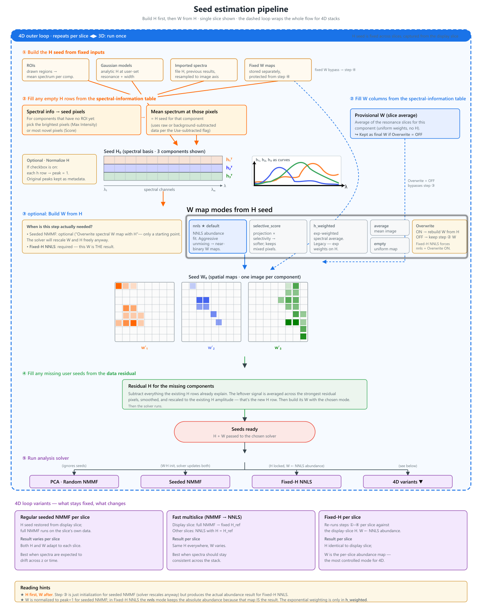
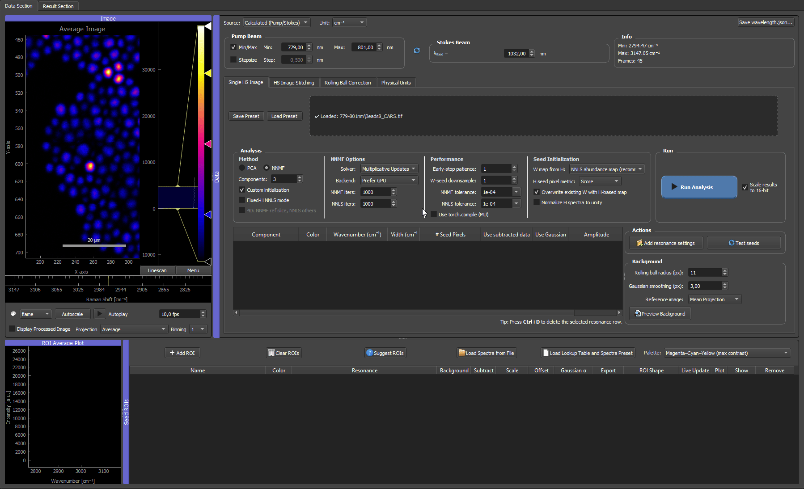
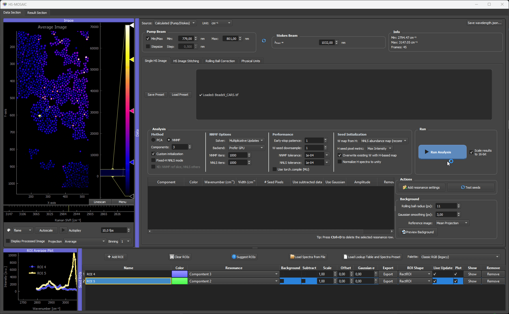

# 03 Seeds, Spectra, And W Maps

Seeds are the main way to guide the analysis. The GUI supports both spectral seeds (**H**) and spatial seeds (**W**). The two are linked: in the most common workflow you provide *one* region of interest (ROI) per component, and the GUI derives both seeds from it.

## Setting Seeds In The GUI: The ROI Workflow

In practice, the most common way to seed a component is to **draw a region of interest (ROI) on the image**. A single ROI feeds the analysis in two linked ways:

- its **mean spectrum** becomes the component's **H seed** (the spectral fingerprint), and
- that H seed is then used to estimate the component's **W seed** (the spatial abundance map) via the chosen W-seed mode.

So one ROI placed on a representative region is usually enough to seed a whole component. You do **not** set H and W separately — drawing the ROI gives the H seed directly, and the W seed is derived from it.

### Step by step

1. **Load an image** and open the **ROI Manager** next to the raw image viewer.
2. **Draw a ROI** over a region that looks representative of one component. The mean spectrum inside the box appears immediately in the ROI average plot — that curve *is* the H seed for the component.
3. **Assign the ROI to a component** (component index, colour, and label) in the ROI table. Several ROIs assigned to the same component are averaged into one H seed.
4. **Refine the ROI** by dragging it to move, or dragging its handles to resize. The mean spectrum updates live as you move or resize, so you can watch the seed spectrum change and settle the box where the fingerprint looks cleanest (strong component signal, little background).
5. **Add a ROI for each remaining component**, one representative region each.
6. **Press Test seeds** to preview the resulting H spectra and W maps before committing to the full run.

*Two ROIs placed on a CARS microbead mixture. Each ROI's spectrum becomes the H seed for its component; dragging and resizing the box updates that spectrum live, so you can settle each ROI where its fingerprint is cleanest.*

!!! important "One ROI seeds both H and W"
    Drawing a single ROI provides the **H seed** (its mean spectrum) directly, and the **W seed** is then estimated from that H seed via the W-seed mode. You rarely set W by hand — pick a good region, check the spectrum, and let the W-seed step build the spatial map. Fixed W maps (imported results or background projections) are the exception, covered under [Dummy ROIs and Fixed W Seeds](#dummy-rois-and-fixed-w-seeds).

For the full reference on every ROI Manager button, row type, and table column, see [ROI Manager in detail](03b_roi_manager.md). The rest of this page explains what each seed type *is* and the other ways to supply them (files, Gaussian models, imported results).

## H Seeds: Spectral Information

`H` seeds describe what the component spectra should look like.

They can come from:

- ROIs drawn directly in the image,
- spectra loaded from files,
- Gaussian resonance models,
- previous NNMF results imported back into the ROI manager.

For spectra loaded from files, the imported spectrum is re-sampled to the current image spectral axis before analysis. The seed actually used by NNMF or NNLS is therefore the prepared spectrum on the active image axis, not the raw file sampling.

By default, seeded NNMF and NNLS-based seed generation keep these spectra on their physical amplitude scale. The GUI does not normalize each seed spectrum independently before building the spectral model. This keeps the relation between `W` and `H` consistent with the underlying factorization idea \(X \approx WH\).

The optional **Normalize H spectra to unity** checkbox changes this seed-preparation step. After all available and residual-filled `H0` spectra have been collected, each `H0` row is scaled by its own maximum so the peak value is 1. The original absolute spectra and scale factors are kept in the fit metadata, while the normalized spectra are displayed in the ROI plot and passed to W-seed construction and analysis.

This is useful when H seeds come from mixed sources, for example ROI averages, imported spectra, Gaussian models, and seed pixels, because it makes their shapes easier to compare. For seeded NNMF this is usually a valid initialization convention: both `W` and `H` are updated during the fit, so the solver can rescale the component pair. For fixed-H NNLS, the normalized `H` basis is the fixed basis, so fitted `W` coefficients are in units of that normalized spectrum and should be compared with that choice in mind.

### Missing H seeds and residual fallback

If a component is missing an `H` seed entirely, the GUI first tries to build one from the data residual before using the older random smooth fallback.

The residual fallback works as follows:

1. The GUI collects the usable `H` seeds that already exist for other components.
2. It chooses the working image data for the missing component. Background components use raw data. Other components use processed/background-subtracted data when **Use subtracted data** is enabled for that component, and raw data when it is disabled.
3. It fits the existing `H` basis to every pixel with non-negative least squares.
4. It subtracts that fitted contribution from the image data and keeps only the positive residual.
5. It ranks the residual pixels (the *seed pixels*: a small set of image pixels whose remaining, unexplained spectrum is taken as the candidate for the new component) by unexplained signal strength. With the **Score** seed-pixel metric, the ranking also favors spectra that are novel relative to the existing seed basis.
6. It takes a small set of the strongest residual spectra, normalizes each candidate spectrum by its own maximum, averages them, smooths the average, and clamps it to positive values.
7. It rescales the new residual-derived `H` seed to the amplitude scale of the existing `H` seed basis where possible. This keeps the new seed comparable to ROI, file, or imported spectra instead of leaving it on a much smaller residual-only scale.

If no stable residual candidate can be built, the legacy random smooth fallback is still used. In fixed-H NNLS setup this means a missing component can still be filled before the `W` maps are solved. The seed-audit warning may appear because the component was missing at the start; choosing **Continue anyway** lets the residual fallback try to fill it, but the resulting seed should still be previewed and checked.

*A three-kind CARS microbead mixture with only two components seeded from ROIs. The third type (polystyrene, cyan) is left without a spectrum; the residual fallback fits the two known spectra, takes the strongest unexplained-residual pixels, and recovers the missing polystyrene spectrum — filling the third component without a drawn ROI.*

In the ROI table, these appear as normal ROI rows or dummy ROI rows. A dummy ROI does not need to correspond to a drawn spatial region; it can carry a spectrum or a fixed W map.

## W Seeds: Spatial Information

`W` seeds describe **where** a component is expected to be present spatially. When only spectral seeds are available, the GUI estimates a W map for each component from the current H basis using a chosen *W-seed mode*:

| Mode | When to use |
|---|---|
| `nnls` | Default. Solves a non-negative least-squares fit against all seeded H spectra at once. Pushes toward **maximum unmixing**, giving near-binary abundance maps. Best when components are expected to occupy **different pixels** (spatially separable chemistries). |
| `selective_score` | Softer alternative. Favors the target spectrum but only down-weights competition instead of forcing one winner per pixel. Prefer this when **mixing across pixels is physically expected** (e.g. co-localized lipids/protein, fluorophore mixtures inside one voxel) — `nnls` tends to over-separate in that regime. |
| `h_weighted` | Legacy channel-weighted heuristic (exponential H-weighting). Rarely needed; useful only when NNLS is unstable. |
| `average` | Uses the mean image. Neutral image-derived fallback. |
| `empty` | Near-zero homogeneous map. Use this when a component should be discovered entirely from the data without a spatial prior. |

**Rule of thumb:** components live in different pixels → `nnls`; components share pixels by design → `selective_score`. If unsure, try `nnls` first and look at the W maps: if they come out implausibly clean and disjoint compared to what you would expect from the sample, switch to `selective_score`. This only affects the *seed*; seeded NNMF can still recover mixed pixels because both `W` and `H` are updated during the fit. See [Picking nnls vs selective_score](../methods/nnmf_nnls_modes.md#picking-nnls-vs-selective_score) for the longer reasoning.

!!! important "The W-seed mode is the most consequential single setting after the H seeds"
    `nnls` and `selective_score` push the analysis toward opposite assumptions: one-component-per-pixel vs many-components-per-pixel. Picking the wrong one usually shows up as either over-separated, implausibly-clean maps (`nnls` on co-localized samples) or smudgy, mixed maps where everything looks similar (`selective_score` on spatially distinct chemistries). If the W maps look wrong, this is the first knob to flip.

### Smoothing the W seed: the W-seed downsample factor

The W-seed mode decides *how* the spatial seed is built; the **W-seed downsample** factor (in the *Performance* column, default **4**) decides *how smooth* it comes out. This is the second knob to reach for when the component spectra **overlap strongly**, because that is exactly when the per-pixel `nnls` seed is noisiest: with near-degenerate spectra, the per-pixel fit is poorly conditioned and the raw abundance map is speckled.

!!! tip "Tune the W-seed downsample for strongly overlapping spectra"
    Downsampling averages the data over small spatial blocks before the per-pixel NNLS, so it suppresses that pixel noise. NNMF then starts from a cleaner spatial map and converges to a smoother, less speckled result. The effect is largest exactly where you need it: the **NNLS abundance** W-seed mode and **strongly overlapping** spectra.

    **Do not overdo it, though.** Too large a factor over-coarsens the seed. The block-mean over large regions, followed by bilinear upsampling, turns fine detail into big uniform blocks, which can show up as blocky zero (or saturated) patches in NNLS abundance seeds. These coarse blocks bias the NNMF initialization and tend to persist in the final maps. Large zero blocks are the worst case: because the multiplicative-update solver grows values multiplicatively from a near-zero start, a region seeded at (near) zero is slow to lift back up, so the block can stay dark in the result. Very high factors make this worse.

    **Recommendation:** keep it moderate. The default **4** balances smoothing against artifacts for most data; drop to **2** (or **1**) if you see blockiness, and reserve **8** for very large mosaics. For *fixed-H NNLS* analysis (where W is the final result, not a seed) set it to **1** instead. See [Analysis modes → Performance column](02_analysis_modes.md#performance-column-v094).

*The W-seed downsample control and its effect on the spatial seed. Moderate values smooth out per-pixel noise; excessive values coarsen the seed into visible blocks (see arrow).*

If an `H` seed is missing for a component, the residual fallback (described above) builds an `H0` first, and then the selected W-seed mode produces the spatial map from that `H0`. Fixed W maps can also be attached to dummy ROIs — useful for background components or for importing spatial maps from previous results.

### W normalization conventions

For **seeded NNMF**, the generated W maps are normalized component-by-component to unit maximum before being used as initialization. NNMF has a per-component scale ambiguity (multiplying one W column by a constant and dividing the matching H row by the same constant leaves \(X \approx W H\) unchanged), so the solver is free to undo this convention while fitting. The point of the normalization is just to keep raw image-count differences from dominating the initial W maps.

For **fixed-H NNLS**, W is the actual fitted coefficient map, not an initialization. Rescaling W alone would change \(W H\) and the reconstruction error, so W is kept on the scale required to reconstruct the data from the fixed H basis. Display and export can still rescale maps for visualization separately.

## Seed Initialization Controls

The **Seed Initialization** controls in the **Analysis** panel decide how seed information is converted into starting matrices for NNMF or fixed spectra for NNLS.

| GUI control | What it affects | Practical default |
|---|---|---|
| **W map from H** | How the GUI estimates spatial W maps from available H spectra. | **NNLS abundance map (recommended)** |
| **H seed pixel metric** | How residual fallback pixels are ranked when a component is missing an H seed. | **Max Intensity** for ordinary use; **Score** when looking for spectrally novel residuals. |
| **Overwrite existing W with H-based map** | Whether H-based W estimation replaces existing W seeds or only fills missing W columns. In fixed-H NNLS mode this is forced on. | Enabled for a clean seeded run; disabled only in seeded NNMF when you want spectral-info W maps to remain dominant. |
| **Normalize H spectra to unity** | Scales completed H seed spectra to max=1 before seed display, W-map reconstruction, and analysis. | Useful when seed spectra come from different sources; use deliberately for fixed-H NNLS because it defines the coefficient scale. |
| **Test seeds** | Builds the current seed matrices and opens the seed preview window without running the final analysis. | Use before long NNMF or 4D runs. |

### Seed-building order

When you press **Test seeds** or start a custom-initialized analysis, the GUI builds the seed matrices in a fixed order. This order matters because later steps can replace earlier W maps.

1. **Reload H seeds from the ROI manager.** Spatial ROIs, imported spectra, Gaussian dummy ROIs, background rows, and imported result spectra define the first `H0` rows. Fixed W maps attached to dummy ROIs are also collected here and are protected from ordinary H-based overwriting.
2. **Read the spectral-information table.** Resonance rows can create temporary W maps from spectral channels or seed pixels. If a component has no ROI/dummy spectrum, seed pixels found from the spectral information can also create an `H0` spectrum for that component.
3. **Complete missing H seeds if needed.** If **Normalize H spectra to unity** is enabled, missing `H0` rows are filled before normalization. The GUI first tries the residual-based H fallback, then the older smooth random fallback if no residual seed can be built.
4. **Optionally normalize H.** If **Normalize H spectra to unity** is enabled, every completed `H0` row is scaled to max=1 and the original row maxima are stored as H scale factors.
5. **Build W from H** using the chosen W-seed mode (see the [W-seed modes table](#w-seeds-spatial-information) above).
6. **Apply the overwrite rule.** If **Overwrite existing W with H-based map** is enabled, the H-based W maps replace any provisional W from step 2 for every component. If it is disabled, only W columns that are still empty get filled. Fixed-H NNLS forces this on.
7. **Fill any remaining W columns.** If a column is still empty, the GUI may complete a missing H row via the residual fallback, re-run W-from-H for that component, and finally fall back to an image-derived W seed (mean image) if everything else failed.

> **What "Overwrite OFF" means in practice.** With Overwrite off, components that have a spectral-info row keep the **provisional W from step 2** (a uniform-weighted average across the resonance frames, no H involvement). Components without a spectral-info row still get a W built from H. So "Overwrite off" is the way to make the spectral-info image the final spatial seed for the corresponding component. Fixed-H NNLS never allows this — the W must be the NNLS abundance fit against the locked H basis.

## ROI-Derived Seeds

For normal spatial ROIs, the mean spectrum inside the ROI can be used as an H seed. Multiple ROIs assigned to the same component can be averaged.

Use ROI-derived seeds when a visible region is representative for a component.

When a candidate region is identified during analysis inspection — for example a structure that appears only in the composite or in residual data — the raw image viewer's **Projection** dropdown can be set to **Composite (from analysis)** so the same composite is shown under the ROI tools. ROIs placed in this view behave like any other ROI and produce an H seed for the next analysis run.

See [Composite projection in the raw image viewer](05_results_and_export.md#composite-projection-in-the-raw-image-viewer) for the projection-mode behaviour and update semantics.

## Gaussian Resonance Seeds

Gaussian models can be generated from manually defined resonance settings. This is useful when the approximate spectral position and width of a component are known.

The Gaussian model creates a dummy ROI row for the relevant component. The row behaves like a spectral seed without requiring a spatial ROI.

*Here the PMMA beads have a known peak at around 2960 cm⁻¹. A Gaussian seed is generated from that resonance position and width, creating a dummy ROI row with the Gaussian spectrum as H seed. We also scaled the spectrum to the data matching absolute intensity*
## Auto-Suggested ROIs

The **Suggest ROIs** tool scans the image for bright or structured regions and turns them into candidate seed ROIs. The output is just a set of ROIs in the ROI Manager — they then feed into the normal seed flow described on this page.

See [Auto-suggested ROIs](03c_suggest_rois.md) for the dialog reference, projection modes, the gradient fingerprint, hierarchical vs greedy grouping, and the internal algorithm walkthrough.

## Display In The ROI Table

The ROI table stores component assignment, color, label, scaling, offset, background/subtraction flags, plotting options, and remove/show actions.

For a detailed explanation of every ROI Manager button, row type, and table column, see [ROI Manager in detail](03b_roi_manager.md).

Rows can represent:

- drawn spatial ROIs,
- loaded spectra,
- Gaussian model spectra,
- imported result spectra,
- W-only result/background seeds.

Rows with fixed W seeds can show their W map without plotting a fake H spectrum.

## Background Components and Background Subtraction

The GUI offers three distinct mechanisms for handling sample background, and they are easy to confuse because the same word "background" appears in all three. They can be combined, but each addresses a different problem.

| Mechanism | Where | What it does | When to use |
|---|---|---|---|
| **Background flag** on an ROI | ROI Manager | Marks one component as the background channel inside the NNMF/NNLS model. The component is fitted alongside the others but treated as the unwanted contribution. | When background has identifiable spatial structure that you want the unmixing to assign explicitly, so it does not bleed into weak chemical components. |
| **Subtract flag** on an ROI | ROI Manager | The mean spectrum of the flagged ROI is subtracted, pixel-wise, from the raw stack. The result is shown in the **Processed** view in the image viewer. The raw image stays untouched. | When you want a flat, background-corrected stack as the input to seed estimation or analysis (a preprocessing step). |
| **Use subtracted data** flag (per component) | Resonance / spectral-info table | For one component, controls whether seed estimation reads from the **raw** stack or the **Processed** (subtracted) view. | When most components fit better on the subtracted data, but one — typically the background itself — must still see the raw signal. |

Concretely: a background component (`Background` flag) lives inside the unmixed result; a subtracted spectrum (`Subtract` flag) is removed *before* analysis sees it; the **Use subtracted data** flag decides which of those two views each individual component looks at when its seed is built.

!!! warning "Three different "background" mechanisms — easy to confuse"
    The same word covers three distinct interventions: a background **component** (kept in the model), a background **subtraction** (removed before fitting), and a per-component **Use subtracted data** flag (which view a single component reads from). When debugging an analysis where weak components look contaminated, check which of the three you actually have enabled — it is common to think the subtraction is on when only the flag is set, or vice versa.

### Background as a model component

The ROI Manager supports marking one or more rows as background components. To do this, enable the **Background** flag in the ROI table for that row. A component marked as background is included in the NNMF/NNLS model but is treated as the background contribution rather than a signal of interest.

This is different from preprocessing: a background component keeps the background signal inside the factorization model and explicitly assigns spatial variation to it, rather than removing it before analysis.

Use this as a fallback for difficult backgrounds, especially when you need an explicit background map during unmixing because otherwise it blends into weak components.
This can substantially reduce background contamination in the other components, which is particularly helpful when the false-colour composite is dominated by background rather than by the chemical signal of interest.

A background W map can also be generated from the analysis panel using a projection image (mean, max, or min). This creates a dummy ROI carrying a fixed W seed derived from the projection. This is useful when the background is hard to draw manually but still has a recognizable smooth spatial pattern.

### Subtraction of background components

The row marked with the **Subtract** flag defines a background ROI. The GUI averages the spectrum inside that ROI and subtracts that mean spectrum from every pixel in the raw stack. The result is shown in the **Processed** view in the raw image viewer.

The raw loaded image is not overwritten. However, processed/subtracted data can be used by seed estimation or analysis steps that explicitly request processed data, so check the Subtract state before running a final analysis.

## Dummy ROIs and Fixed W Seeds

A dummy ROI is a row in the ROI Manager that carries seed information without being tied to a drawn spatial region. Dummy ROIs are used for:

- **Loaded spectra**: a file-based H seed without a spatial ROI.
- **Gaussian resonance models**: a Gaussian-shaped H seed for a known resonance position.
- **Fixed W seeds**: a spatial abundance map provided from outside the current analysis (for example, from a previous result or from a background projection image).
- **Imported result components**: a full H + W seed imported from a previous analysis run.

A dummy ROI carrying a fixed W map does not display a spectral plot for H; instead it shows the fixed W map directly. The W map stays fixed during NNMF if the row is configured as a fixed W seed.

This is useful when a reliable spatial reference exists (e.g., a clean background illumination map) and you do not want the model to re-estimate it from scratch.

## Importing Result Components as Seeds

After a PCA or NNMF run, result components can be imported back into the ROI Manager as seed rows. Import options:

- **H only**: the fitted spectrum becomes an H seed for a new run.
- **W only**: the fitted map becomes a fixed W seed.
- **H + W**: both are imported as a combined seed.

This is the standard iterative workflow:

1. Run random NNMF to get an initial non-negative decomposition.
2. Import the best result components as H seeds.
3. Adjust ROIs or add missing components.
4. Run seeded NNMF or fixed-H NNLS.

Imported result components appear as dummy ROI rows in the ROI Manager.

## Exporting Seeds

Seeds and ROI state can be saved through presets. Spectral components can also be exported as CSV from the result viewer. For reproducible workflows, save the preset together with the input data and expected output.
