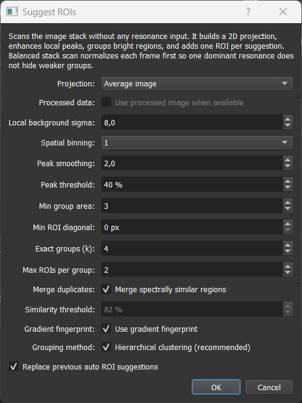

# 03 Seeds, Spectra, And W Maps

Seeds are the main way to guide the analysis. The GUI supports both spectral seeds and spatial seeds.

## H Seeds: Spectral Information

`H` seeds describe what the component spectra should look like.

They can come from:

- ROIs drawn directly in the image,
- spectra loaded from files,
- Gaussian resonance models,
- previous NNMF results imported back into the ROI manager.

For spectra loaded from files, the imported spectrum is re-sampled to the current image spectral axis before analysis. The seed actually used by NNMF or NNLS is therefore the prepared spectrum on the active image axis, not the raw file sampling.

For seeded NNMF and NNLS-based seed generation, these spectra are kept on their physical amplitude scale. The GUI does not normalize each seed spectrum independently before building the spectral model. This keeps the relation between `W` and `H` consistent with the underlying factorization idea \(X \approx WH\).

### Missing H seeds and residual fallback

If a component is missing an `H` seed entirely, the GUI first tries to build one from the data residual before using the older random smooth fallback.

The residual fallback works as follows:

1. The GUI collects the usable `H` seeds that already exist for other components.
2. It chooses the working image data for the missing component. Background components use raw data. Other components use processed/background-subtracted data when **Use subtracted data** is enabled for that component, and raw data when it is disabled.
3. It fits the existing `H` basis to every pixel with non-negative least squares.
4. It subtracts that fitted contribution from the image data and keeps only the positive residual.
5. It ranks residual pixels by unexplained signal strength. With the **Score** seed-pixel metric, the ranking also favors spectra that are novel relative to the existing seed basis.
6. It takes a small set of the strongest residual spectra, normalizes each candidate spectrum by its own maximum, averages them, smooths the average, and clamps it to positive values.
7. It rescales the new residual-derived `H` seed to the amplitude scale of the existing `H` seed basis where possible. This keeps the new seed comparable to ROI, file, or imported spectra instead of leaving it on a much smaller residual-only scale.

If no stable residual candidate can be built, the legacy random smooth fallback is still used. In fixed-H NNLS setup this means a missing component can still be filled before the `W` maps are solved. The seed-audit warning may appear because the component was missing at the start; choosing **Continue anyway** lets the residual fallback try to fill it, but the resulting seed should still be previewed and checked.

In the ROI table, these appear as normal ROI rows or dummy ROI rows. A dummy ROI does not need to correspond to a drawn spatial region; it can carry a spectrum or a fixed W map.

> GIF placeholder: drawing a ROI and seeing its spectrum appear in the ROI average plot.

## W Seeds: Spatial Information

`W` seeds describe where a component is expected to be present spatially.

The GUI can estimate W maps from H seeds using different modes:

- NNLS abundance map,
- selective score map,
- H-weighted average,
- average image fallback,
- homogeneous empty map.

The modes do not all have the same meaning. The NNLS abundance map is a direct coefficient estimate from the seeded spectra. The selective score map is a heuristic spatial guess based on spectral projection and competition. H-weighted and average modes are image-derived fallbacks.

For seeded NNMF, generated W maps are normalized component by component to unit maximum before they are used as initialization. This is intentional. NNMF has a per-component scale ambiguity: multiplying one W column by a constant and dividing the matching H row by the same constant leaves \(X \approx W H\) unchanged. During seeded NNMF, both W and H are updated, so the solver can adapt the matching H row to the normalized W seed scale while fitting the data. Since ROI-derived H seeds usually carry the spectral/count scale, normalized W seeds mainly encode spatial abundance shape and are comparable between components.

| Mode | When to use |
|---|---|
| `nnls` | Default. The most aggressive option — fits every pixel against all seeded spectra at once and pushes toward maximum unmixing, giving near-binary abundance maps. Best when components are expected to occupy **different pixels** (spatially separable chemistries). |
| `selective_score` | The softer alternative. Favors the target spectrum but only down-weights competition instead of forcing one winner per pixel. Prefer this when **mixing across pixels is physically expected** (e.g. co-localized lipids/protein, fluorophore mixtures inside one voxel) — `nnls` tends to over-separate in that regime. |
| `h_weighted` | Legacy channel-weighted heuristic. Rarely needed, but can help when NNLS is unstable. |
| `average` | Uses the mean image. A neutral starting point that lets NNMF build all spatial structure from scratch. |
| `empty` | Near-zero homogeneous map. Use this when a component should be discovered entirely from the data without a spatial prior. |

A quick rule of thumb: components live in different pixels → `nnls`; components share pixels by design → `selective_score`; if unsure, try `nnls` first and look at the W maps — if they come out implausibly clean and disjoint compared to what you'd expect from the sample, switch to `selective_score`. This only affects the *seed*; seeded NNMF can still recover mixed pixels because `W` and `H` are both updated during the fit. See [Picking nnls vs selective_score](../methods/nnmf_nnls_modes.md#picking-nnls-vs-selective_score) for the longer reasoning.

For the special case above where an `H` seed is missing, the residual spectrum is first derived from a fit against the already available `H` seeds. The residual-derived spectrum fills the missing spectral seed; after that, the selected W-seed mode builds the spatial map for that component.

Fixed W maps can also be attached to dummy ROIs. These fixed W seeds are useful for background components or for importing spatial maps from previous results.

Do not confuse normalized W seeds with fixed-H NNLS result maps. The per-component scale ambiguity is useful for NNMF initialization because both W and H can still change. In fixed-H NNLS, H is locked and W is the actual fitted coefficient map. Rescaling W alone would change \(W H\) and the reconstruction error, so those coefficients should keep the scale needed to reconstruct the measured data from the fixed spectra; visualization/export scaling is a separate step.

## Seed Initialization Controls

The **Seed Initialization** controls in the **Analysis** panel decide how seed information is converted into starting matrices for NNMF or fixed spectra for NNLS.

| GUI control | What it affects | Practical default |
|---|---|---|
| **W map from H** | How the GUI estimates spatial W maps from available H spectra. | **NNLS abundance map (recommended)** |
| **H seed pixel metric** | How residual fallback pixels are ranked when a component is missing an H seed. | **Max Intensity** for ordinary use; **Score** when looking for spectrally novel residuals. |
| **Overwrite existing W with H-based map** | Whether H-based W estimation replaces existing W seeds or only fills missing W columns. | Enabled for a clean seeded run; disabled when you imported or generated fixed W maps that should stay dominant. |
| **Test seeds** | Builds the current seed matrices and opens the seed preview window without running the final analysis. | Use before long NNMF or 4D runs. |

### Overwriting W maps from H

When **Overwrite existing W with H-based map** is enabled, any W image that was gathered from the spectral information table is treated as temporary for components that already have a usable `H` seed. The final `W` seed is rebuilt from the `H` seed and the active **W map from H** mode, for example with an NNLS abundance fit.

This means the spectral-info image itself is completely unused as the final `W` seed for that component. If a component already has a valid `H` seed and overwrite is enabled, spectral-info settings such as resonance position, width, amplitude, and seed-pixel count generally do not shape the final `W` map. The important exception is the **Use subtracted data** setting, which can still decide whether the H-based map and residual seed estimation use processed/background-subtracted data or raw data.

If you want the W image gathered from spectral information to remain the spatial seed, disable **Overwrite existing W with H-based map** or attach the map as a fixed W seed. If no valid `H` seed exists yet, spectral information can still help create or fill the missing spectral seed before the H-based map is built.

## ROI-Derived Seeds

For normal spatial ROIs, the mean spectrum inside the ROI can be used as an H seed. Multiple ROIs assigned to the same component can be averaged.

Use ROI-derived seeds when a visible region is representative for a component.

## Gaussian Resonance Seeds

Gaussian models can be generated from manually defined resonance settings. This is useful when the approximate spectral position and width of a component are known.

The Gaussian model creates a dummy ROI row for the relevant component. The row behaves like a spectral seed without requiring a spatial ROI.

> GIF placeholder: adding a resonance setting and seeing a Gaussian dummy ROI appear.

## Auto-Suggested ROIs

The ROI suggestion tool searches for bright or structured image regions that can be useful seed candidates.

The method runs in two stages. First it builds a 2D response map by collapsing the spectral stack and enhancing local bright structures. Then it groups the spatial candidates by spectral similarity so distinct component types get separate ROIs instead of being collapsed into one.

The dialog scans the current image stack without requiring resonance positions or reference spectra.

### Settings reference

| Setting | What it controls | Default | Practical effect |
|---|---|---|---|
| **Projection** | How the spectral stack is collapsed into one 2D response image. | Average image | See projection modes below. |
| **Processed data** | Whether the processed/background-subtracted stack is used when available. | Off | Enable if subtraction reveals the structures you want better than the raw stack. Disabled when no processed data are available. |
| **Local background sigma** | Size of the blurred background estimate subtracted from the projection. | 8 px | Increase to suppress broad illumination gradients. Lower if real broad structures are suppressed. |
| **Spatial binning** | Downsampling before peak finding. | 1× | Higher binning is faster and more robust against pixel noise, but can miss very small structures. |
| **Peak smoothing** | Gaussian smoothing applied to the response map before candidate detection. | σ = 1 | Increase to suppress noisy speckles. Decrease to keep sharp or small structures. |
| **Peak threshold** | Required brightness relative to the response map. | 0.65 | Lower finds more and weaker regions. Higher keeps only the strongest candidates. |
| **Min group area** | Smallest connected bright region accepted as a candidate (pixels in binned projection). | 3 px² | Increase to reject detector noise or isolated hot pixels. |
| **Min ROI diagonal** | Minimum size of the final ROI box in pixels. | 0 px | Use to discard very small artefact ROIs. `0 px` disables this filter. |
| **Max suggested groups** | Maximum number of distinct spectral groups to create in one run. Also sets the cluster count for hierarchical grouping. | 3 | Set slightly higher than the number of expected components to give the algorithm room to find all of them. |
| **Max ROIs per group** | Maximum number of spatial ROIs kept per spectral group. | 1 | Increase when multiple examples of the same component are useful for averaging. |
| **Merge duplicates** | Whether regions with very similar mean spectra are merged into one component group. | On | Keep enabled so the suggester does not fill the table with copies of the same spectral class. |
| **Similarity threshold** | Spectral similarity cutoff used **only in greedy grouping mode**. Has no effect when hierarchical grouping is on. | 0.82 | Higher merges fewer regions. Lower merges more aggressively. Only tune this when hierarchical grouping is disabled. |
| **Gradient fingerprint** | Augments the spectral fingerprint with the spectral derivative before similarity is computed. | On | Helps separate components that share a dominant peak but differ in slope, shoulder, or tail. See explanation below. |
| **Hierarchical grouping** | Uses Ward hierarchical clustering to force exactly *k* groups from the candidate pool instead of merging greedily by threshold. | On | More reliable when components are spectrally similar. Greedy mode (off) can be used when the number of distinct components is uncertain. |
| **Replace previous auto ROI suggestions** | Removes only earlier auto-suggested ROIs before creating new suggestions. | On | Keep enabled while tuning settings. Disable to accumulate batches without removing earlier suggestions. |

### Gradient fingerprint — how it works and why it matters

When two spectra are compared, the default measure is **cosine similarity on raw intensity**: it asks how much the two intensity traces point in the same direction. This works well for spectra that look fundamentally different. But for closely related variants — such as a lipid and a slightly modified lipid — both spectra might share a large, dominant peak at the same position. The raw intensity comparison sees that shared peak and reports 85–95% similarity, even though the two components differ meaningfully in the slope leading up to the peak, the steepness of the descent, or the presence of a small shoulder.

The gradient fingerprint adds a second channel of information by also comparing **how the spectrum changes across channels** — its first derivative. Intuitively:

- Two spectra with the same dominant peak but different rising edges will have very different derivatives near that peak.
- A shoulder that is invisible as a bump in intensity becomes a clear local maximum in the derivative trace.
- A broad flat peak and a sharper narrower peak can look almost identical in intensity but have very different curvature profiles.

Concretely, the algorithm computes the derivative trace, normalises both the intensity part and the derivative part independently (so neither dominates), and concatenates them into one combined fingerprint vector that is twice as long as the original spectrum. All similarity comparisons and clustering distances are then computed on this combined vector.

**The result:** two components that differ only in spectral shape details — not in peak position — become more distinguishable. In tests on synthetic bead data with five closely related lipid/protein variants (pairwise cosine similarities of 0.85–0.95 on raw intensity), enabling the gradient fingerprint improved separation from 2 to 3–4 detected components out of 5.

**When to turn it off:**
- Spectra that are extremely smooth or consist of a single featureless broad peak have almost no derivative structure. The gradient channel adds only noise in that case.
- Very noisy spectra (low SNR) where the derivative amplifies noise faster than it reveals real shape differences. In that case, increase **Peak smoothing** first.

**Interaction with the similarity threshold:** the gradient fingerprint changes what the fingerprint vector *is*, but the threshold and clustering operate on that fingerprint regardless. In **hierarchical mode** (default) the threshold is not used at all — the Ward clustering works from pairwise distances on the gradient-augmented fingerprints. In **greedy mode**, the threshold is compared against cosine similarity on the gradient-augmented fingerprints, so a gradient fingerprint effectively makes the threshold stricter: two spectra that were 88% similar on raw intensity might be only 80% similar once the gradient differences are included.

### Projection modes

**Balanced stack scan** (recommended starting point)
Each spectral channel is independently normalized before being combined into the projection. This prevents one dominant resonance from overwhelming weaker ones, so all components get a fair chance to appear in the response map.

**Multi-band scan**
The stack is split into several spectral bands and each band is projected independently. Candidates from all bands are then merged while suppressing spatial duplicates.

Use this when your data spans a wide spectral range and contains many distinct resonances that are spread across separate regions of that range — for example, a CARS stack that covers both the fingerprint region (1000–1800 cm⁻¹) and the CH-stretch region (2800–3100 cm⁻¹) at the same time. In that case a single projection — even a balanced one — still collapses the whole spectrum into one image, and components that are only bright in one narrow band can get buried by activity from other bands. Multi-band scan gives each spectral region its own independent projection pass, so components isolated to one region have a fair chance of being detected.

If your stack is narrower and all components share roughly the same spectral region, Balanced stack scan is sufficient and faster. Multi-band scan is slower and only pays off when resonances are genuinely distributed across multiple distinct spectral windows. Set **Exact groups (k)** to the total expected number of components across all bands combined.

**Average image**
Simple mean of all channels. Faster. Biased toward structures that are bright across many channels. Good when all features are prominent and the stack has high SNR.

**Maximum projection**
Keeps the brightest value across all channels at each pixel. Useful for locating any structure that is bright in at least one channel, but tends to over-detect in noisy stacks.

**Current frame**
Uses only the currently displayed channel. Use for single-channel inspection or to seed a component known to be visible at one specific resonance.

### Choosing settings for your data

**Start with Average image and defaults.** For most datasets this is sufficient — channels are typically in a comparable intensity range and the average gives a clean spatial contrast map. Switch to Balanced stack scan only if one channel dominates so strongly that weaker components disappear in the average.

**If components are missed:**
- Increase **Max suggested groups** by 1–2 above the expected number of components.
- Lower **Peak threshold** (try 0.25–0.35) to accept weaker candidates.
- Reduce **Peak smoothing** (try σ = 1) if features are small or sharp.
- Switch to **Multi-band scan** if missed components are known to be in a different spectral region than the detected ones.

**If too many spurious suggestions appear:**
- Increase **Peak threshold** (try 0.50–0.60).
- Increase **Min group area** (try 8–20 px²) to reject small noise artefacts.
- Increase **Spatial binning** (try 2× or 4×) for very noisy data.

**For spectrally similar components (e.g., closely related cell types, lipid subtypes):**
Keep **Gradient fingerprint** on. The gradient encodes slope and shoulder information that pure intensity cosine similarity cannot distinguish. Keep **Hierarchical grouping** on so that forced-k clustering separates the candidates instead of collapsing them by threshold.

> **Hierarchical grouping: all suggested ROIs look the same?**
> Hierarchical clustering forces exactly k groups from whatever spatial candidates the first stage found. If all k groups end up representing the same component type, the candidate pool itself is too uniform — the dominant structure was simply detected k times in different spots. The fix is upstream: lower **Peak threshold** (try 0.25–0.35) so the spatial scan also picks up weaker, less prominent structures that may belong to other components. If those weaker structures are small or sharp, also reduce **Peak smoothing** (try σ = 1) so they are not blurred out before detection. With a more diverse candidate pool, the clustering has something real to separate.

**For noisy data (low SNR, shot-noise dominated):**
Use **Peak smoothing** σ = 2 (default) or higher. A higher **Spatial binning** also helps. Increase **Local background sigma** if illumination is uneven.

**For clean data with sharp, well-separated features:**
**Peak smoothing** σ = 1 often works better. The default σ = 2 may blur small features or merge nearby peaks.

**The similarity threshold matters most in greedy mode.** With **Hierarchical grouping** on (default), the algorithm forces exactly k clusters regardless of pairwise similarity, so the threshold has less influence. If you switch to greedy mode, lower the threshold (0.75–0.80) for closely related spectra and raise it (0.88–0.92) for clearly distinct ones.

**Fundamental limitation:** components whose spectra differ by less than ≈5–10% cosine distance (e.g., one spectrum is a near-linear combination of another) cannot be reliably separated by any spectral grouping method. In that case, draw ROIs manually in regions where one component is visually dominant.

After suggestions are created, treat them like normal ROIs: move or resize them if needed, rename the rows, assign colors, check the ROI average spectra, and remove suggestions that are not useful seeds.

### How the algorithm works internally

This section is for advanced users who want to understand what happens under the hood and why certain settings have the effect they do.

#### Stage 1 — Response map

The spectral stack (channels × height × width) is collapsed into one 2D response image depending on the chosen projection mode. In **Balanced stack scan** mode each channel is independently contrast-normalized before combining, and channels are averaged with weights proportional to their spatial variance — channels that carry more spatial structure contribute more. This prevents a single dominant resonance from drowning out weaker ones.

A blurred copy of the projection (radius controlled by **Local background sigma**) is then subtracted to suppress broad illumination gradients. The result is divided by the local standard deviation to normalize for local contrast variation. The final map therefore reflects relative local brightness rather than absolute intensity — a dim structure in a quiet region of the image can score just as highly as a bright structure in a bright region.

#### Stage 2 — Candidate extraction from the response map

**Coarsen and smooth.** The normalized map is downsampled by **Spatial binning** and then Gaussian-blurred by **Peak smoothing**. This suppresses pixel noise before any detection decisions are made and defines the spatial scale at which objects are expected.

**Local maxima.** A maximum filter marks every pixel that is the brightest in its local neighborhood. These become candidate peak locations.

**Multi-threshold sweep.** Rather than applying one fixed threshold, the algorithm sweeps across 8 levels from the user's **Peak threshold** down to roughly 8% of the map maximum. At each level a percentile floor also drops (from the 75th to the 15th percentile of positive values) to prevent the floor from suppressing detections in low-signal images. This sweep is why the algorithm can find both a dominant bright structure and a weaker structure that is 3–5× dimmer in the same run — the dominant structure is captured at the high threshold and the weaker one is picked up at a lower level.

**Connected-component labeling.** At each threshold level the thresholded map is segmented into connected blobs. Each blob is a candidate object. Blobs smaller than **Min group area** are discarded.

**Peak-to-box refinement.** Inside each blob the local maxima are ranked by brightness. For each peak a secondary threshold is applied at 72% of that peak's own value, carving out the tight bright core around it. The bounding box of that core becomes the proposed ROI box, padded outward by a few pixels.

**IoU deduplication.** Before accepting a box it is compared against all previously accepted boxes. If it overlaps an existing box by ≥ 60% (within the same blob) or ≥ 45% (across the whole sweep) it is discarded. This prevents the same structure being proposed repeatedly at different threshold levels.

**Scale back.** Boxes are scaled from the coarsened coordinate system back to the original image pixels, with padding added.

The output of this stage is a pool of spatial candidates ranked by peak brightness, capped at `Exact groups × Max ROIs per group × pool factor`.

#### Stage 3 — Spectral grouping

Each candidate ROI's mean spectrum is extracted and converted into a spectral fingerprint. With **Gradient fingerprint** on, the fingerprint is the concatenation of the unit-normalised spectrum and its unit-normalised first derivative, making shape differences (shoulders, slopes, tails) visible alongside peak positions.

**Hierarchical grouping** (default) applies Ward linkage clustering on the pairwise cosine distances between fingerprints and cuts the resulting tree at exactly k clusters, where k = **Exact groups**. This forces separation even between candidates that are spectrally similar, which greedy threshold merging would collapse into one group.

**Greedy grouping** (hierarchical off) instead walks the ranked candidate list and merges each new candidate into the most similar existing group if the cosine similarity exceeds the **Similarity threshold**, otherwise starting a new group.

#### Where the algorithm works well and where it does not

The spatial stage is reliable for isolated compact objects — beads, nuclei, cells, labelled structures — where different component types occupy different spatial positions in the image.

It cannot separate spatially overlapping components. If two materials are mixed within the same pixel region the spatial stage sees one blob, and only the spectral grouping stage can try to resolve the difference. If those two materials are also spectrally very similar (cosine similarity ≥ 0.90), no grouping method can reliably distinguish them automatically — manual ROI placement in regions where one material dominates is the only reliable path.

Very large structures that fill most of the image may be suppressed by the local background subtraction step. And if the dominant structure is so bright that the threshold sweep fills its entire candidate quota before reaching lower thresholds, weaker structures will not appear in the pool at all — lower the **Peak threshold** or increase **Exact groups** to give the sweep more room.

## Display In The ROI Table

The ROI table stores component assignment, color, label, scaling, offset, background/subtraction flags, plotting options, and remove/show actions.

For a detailed explanation of every ROI Manager button, row type, and table column, see [ROI Manager in detail](03b_roi_manager.md).

Rows can represent:

- drawn spatial ROIs,
- loaded spectra,
- Gaussian model spectra,
- imported result spectra,
- W-only result/background seeds.

Rows with fixed W seeds can show their W map without plotting a fake H spectrum.

## Background Components and Background Subtraction

### Background as a model component

The ROI Manager supports marking one or more rows as background components. To do this, enable the **Background** flag in the ROI table for that row. A component marked as background is included in the NNMF/NNLS model but is treated as the background contribution rather than a signal of interest.

This is different from preprocessing: a background component keeps the background signal inside the factorization model and explicitly assigns spatial variation to it, rather than removing it before analysis.

Use this as a fallback for difficult backgrounds, especially when you need an explicit background map during unmixing because otherwise it blends into weak components.
This can help to reduce the contribution of background signifcantly in other components with specific signal information.

A background W map can also be generated from the analysis panel using a projection image (mean, max, or min). This creates a dummy ROI carrying a fixed W seed derived from the projection. This is useful when the background is hard to draw manually but still has a recognizable smooth spatial pattern.

### Subtraction of background components

The row marked with the **Subtract** flag defines a background ROI. The GUI averages the spectrum inside that ROI and subtracts that mean spectrum from every pixel in the raw stack. The result is shown in the **Processed** view in the raw image viewer.

The raw loaded image is not overwritten. However, processed/subtracted data can be used by seed estimation or analysis steps that explicitly request processed data, so check the Subtract state before running a final analysis.

> GIF placeholder: marking a component as background, generating a background W map, and viewing the subtracted result.

## Dummy ROIs and Fixed W Seeds

A dummy ROI is a row in the ROI Manager that carries seed information without being tied to a drawn spatial region. Dummy ROIs are used for:

- **Loaded spectra**: a file-based H seed without a spatial ROI.
- **Gaussian resonance models**: a Gaussian-shaped H seed for a known resonance position.
- **Fixed W seeds**: a spatial abundance map provided from outside the current analysis (for example, from a previous result or from a background projection image).
- **Imported result components**: a full H + W seed imported from a previous analysis run.

A dummy ROI carrying a fixed W map does not display a spectral plot for H; instead it shows the fixed W map directly. The W map stays fixed during NNMF if the row is configured as a fixed W seed.

This is useful when a reliable spatial reference exists (e.g., a clean background illumination map) and you do not want the model to re-estimate it from scratch.

## Importing Result Components as Seeds

After a PCA or NNMF run, result components can be imported back into the ROI Manager as seed rows. Import options:

- **H only**: the fitted spectrum becomes an H seed for a new run.
- **W only**: the fitted map becomes a fixed W seed.
- **H + W**: both are imported as a combined seed.

This is the standard iterative workflow:

1. Run random NNMF to get an initial non-negative decomposition.
2. Import the best result components as H seeds.
3. Adjust ROIs or add missing components.
4. Run seeded NNMF or fixed-H NNLS.

Imported result components appear as dummy ROI rows in the ROI Manager.

## Exporting Seeds

Seeds and ROI state can be saved through presets. Spectral components can also be exported as CSV from the result viewer. For reproducible workflows, save the preset together with the input data and expected output.
