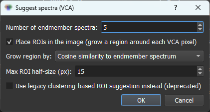

# 03d Suggest spectra (VCA)

When you do not yet have seeds and do not want to draw ROIs by hand, the **Suggest spectra (VCA)** button in the ROI Manager estimates the pure component spectra directly from the data and can place ROIs for them automatically. In practice this is the most reliable automatic seeding option in HS-MOSAIC, and it is a good first step on unfamiliar data.

## What VCA is

**Vertex Component Analysis (VCA)** is a geometric endmember-extraction method. Under the linear mixing model, every pixel spectrum is a non-negative mixture of a few pure component spectra ("endmembers"), so all pixels lie inside a simplex whose **vertices are the pure spectra**. VCA finds those vertices. It is unsupervised (it only needs the number of components) and fast (the cost is dominated by a small spectral-axis-sized SVD, not by the number of pixels).

VCA is described in:

> J. M. P. Nascimento and J. M. B. Dias, "Vertex Component Analysis: A Fast Algorithm to Unmix Hyperspectral Data," *IEEE Transactions on Geoscience and Remote Sensing* 43(4), 898–910, 2005. DOI: [10.1109/TGRS.2005.844293](https://doi.org/10.1109/TGRS.2005.844293).

## How it works

VCA first reduces the data to the signal subspace with an SVD, then repeatedly projects the data onto a direction orthogonal to the endmembers found so far and selects the **most extreme pixel** as the next vertex. It returns one pure spectrum per component (these become the **H seeds**) together with the pixel each spectrum came from.

The one assumption to keep in mind is the **pure-pixel assumption**: VCA works best when each component has at least one near-pure pixel in the image. When spectra overlap strongly or the data is noisy, VCA still returns the most extreme pixels, but they may be less pure, so inspect the suggested spectra before running the analysis.

*The **Suggest spectra (VCA)** dialog. Set the number of endmember spectra (defaults to the analysis component count), choose whether to place ROIs and how to grow them, and cap their size with **Max ROI half-size**. The toggle at the bottom switches to the deprecated clustering-based suggester after confirming.*

## Using it

Press **Suggest spectra (VCA)** in the ROI Manager. The dialog offers:

- **Number of endmember spectra** — defaults to the component count set in the Analysis panel.
- **Place ROIs in the image** (on by default) — see the two modes below.
- **Grow region by** — how the region around each endmember pixel is grown: **Cosine similarity to the endmember spectrum** (default), or the **Least-squares / Selective score / NNLS** abundance map.
- **Max ROI half-size (px)** — caps how far the box may grow from the endmember pixel. `0` keeps only the single endmember pixel; otherwise the box grows but never exceeds `2 × value + 1` px per side, centered on the pixel.

Two modes, controlled by the checkbox:

- **Place ROIs off** — the VCA endmember spectra are added directly as **dummy ROI rows** (H seeds), the same way loaded spectra are. No spatial region is selected.
- **Place ROIs on** (default) — for each endmember the GUI anchors on the pixel VCA selected and **grows a rectangular ROI** outward from it, expanding to the connected region that stays similar by the chosen measure (capped by the max half-size). The ROI's own mean spectrum then becomes the seed. If a region degenerates to nothing, that component falls back to a dummy spectrum row.

This means VCA gives you either ready-to-use spectral seeds or real, editable ROIs anchored on each component's purest pixel. Either way the result feeds the normal seed flow described in [Seeds, spectra, and W maps](03_seeds_spectral_and_spatial.md), and you can edit, recolor, or remove any suggestion before running.

*VCA on the [synthetic quickstart dataset](../examples/synthetic_quickstart.md). Pressing **Suggest spectra (VCA)** with the **Max ROI half-size** lowered to 5 px keeps each grown ROI tight around its endmember pixel. VCA recovers all five pure spectra in one pass, including the broad, slowly varying background captured as component 1. Running the analysis and hiding component 1 clearly shows the separation of every beads species. You can reproduce this on the same data shipped with the GUI (see the [synthetic quickstart](../examples/synthetic_quickstart.md)).*

## Legacy: clustering-based Suggest ROIs

A different, purely spatial automatic method is also available. It is now deprecated in favor of VCA, but still works for spatial blob detection. See [Suggest ROIs (clustering-based, legacy)](03c_suggest_rois.md).
