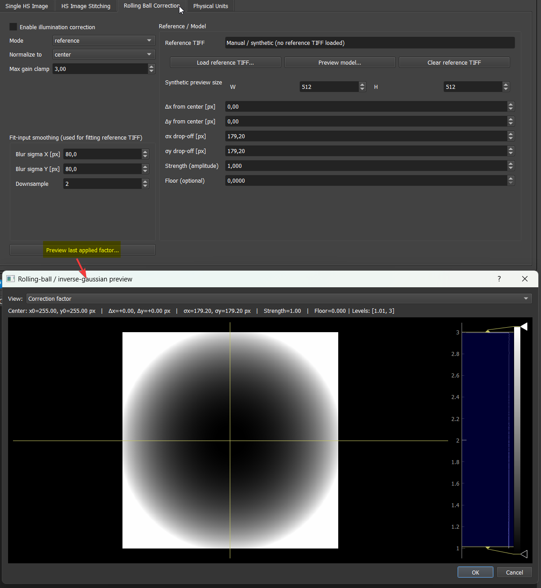
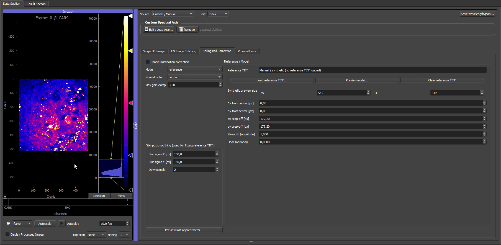
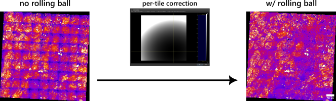

# 04 Physical units and rolling-ball correction

This page covers physical pixel sizes, scale bars, TIFF metadata, and rolling-ball illumination correction.

## Physical units

The physical units panel stores:

- Unit.
- Pixel size.
- Field of view.
- Image shape.
- Scale-bar options.

Supported display units are:

- `nm`
- `um`
- `mm`

When a TIFF contains Fiji/ImageJ pixel-size metadata, the GUI can read it and update the physical-unit fields automatically.

> Screenshot placeholder: physical-units panel after loading a TIFF with pixel-size metadata.

## Scale bars and Fiji export

The physical pixel size is used for scale bars in the GUI and for Fiji/ImageJ-compatible export metadata.

Check the pixel size before exporting publication images, especially after:

- Binning.
- Stitching.
- Loading a preset.
- Loading data from a different microscope.

## Illumination correction

The rolling-ball correction tab is used as an illumination-correction preprocessor for 2D and 3D data. Use it when the image has smooth shading, vignetting, or a broad multiplicative illumination pattern that should be corrected before ROI work, stitching, analysis, or export.

The correction can be configured in two main ways:

- **Reference/manual model**: use `reference` mode. The model can be fitted from a reference TIFF, but it can also be edited manually without loading a reference image. This is useful when you want to tune `dx`, `dy`, `sigma_x`, `sigma_y`, `strength`, and `floor` from the preview.
- **Per-image estimation**: use `blur` or `gaussfit`. These modes estimate a smooth correction field from each image separately.

### Reference TIFF workflow on one tile

This example uses the same three-channel multispectral liver tile data as the [stitching tutorial](01b_stitching_tile_folders.md). A single tile is loaded first and the CARS channel is inspected, where the broad rolling-ball illumination profile is visible as a smooth intensity falloff across the field of view.

The same tile is then loaded as the **Reference TIFF** in the rolling-ball correction tab. The reference image is blurred and downsampled only to estimate the broad illumination envelope; this prevents cellular or tissue structure from being treated as part of the correction model. The fitted model is then applied to the image, and the corrected CARS channel becomes much flatter intensity-wise.

> **Stitching compatibility:** If you change illumination-correction settings after a stitch has already been generated, rerun the stitch so the updated correction is applied to the tiles.

### Applying the correction before stitching

In the stitched liver example, the rolling-ball correction is applied to each tile before the tiles are combined. This is different from **Match tile intensities** in the stitching tab: the rolling-ball model corrects the smooth illumination field inside every tile, while intensity matching only rescales neighbouring tiles in their overlap regions.

The final stitched result depends on tuning the model center and intensity drop-off. In practice this means adjusting `dx`, `dy`, `sigma_x`, `sigma_y`, `strength`, and `floor` until the preview field matches the measured shading pattern without overcorrecting real sample structure. The PNG shows the stitched liver data after this tuning step.

## Settings reference

| Setting | What it controls | Default | Practical effect |
|---|---|---|---|
| **Enable illumination correction** | Master on/off switch for the whole panel. | Off | Leave off unless you clearly see smooth shading, vignetting, or broad multiplicative illumination variation. |
| **Mode** | Which estimation strategy is used: `reference` (one stored model for all images), `blur` (per-image smoothed estimate), or `gaussfit` (per-image Gaussian-like fit). | `reference` | `reference` is the right choice for stitching and for consistent batch preprocessing. `blur` / `gaussfit` are for cases where no stable reference exists and the illumination pattern changes per image. |
| **Normalize to** | Which reference point the correction is normalised to: `center`, `median`, or `mean`. | `center` | `center` works when the centre of the field is the natural reference region. Use `median` when the centre is not representative, or `mean` to keep the global average intensity stable. |
| **Max gain clamp** | Caps how strongly dark regions may be amplified by the correction. | — | Increase only if under-corrected edges remain visible. If noisy corners become too bright, reduce it. |
| **Blur sigma X / Y [px]** | Smoothing applied to the *input* before fitting a reference TIFF or running a per-image fit. Does not change the final correction model directly. | — | Increase when the reference contains strong sample structure, or when the fit is following fine image details too closely. Larger sigmas → only the large-scale illumination profile remains. |
| **Downsample** | Downsampling factor of the fit input. | — | Increase for very large references or when fitting is slow. Only relevant if you only care about the broad illumination envelope. |
| **dx, dy** | Centre offset of the illumination pattern relative to the image centre, in pixels. | `0, 0` | Shift to align the modelled illumination peak with the bright spot of the actual image. |
| **sigma_x, sigma_y** | Spatial width of the illumination profile along x and y. | — | Larger sigmas → broader, gentler correction. Smaller sigmas → tighter correction localised around `(dx, dy)`. |
| **strength** | Scalar multiplier applied to the correction field. | `1` | `1` is the standard case. Smaller values weaken the correction, larger values strengthen it. |
| **floor** | Adds a constant baseline to the correction to bound the gain in dark regions. | — | Increase to avoid extreme amplification of dark areas; reduce for a more aggressive correction. |
| **Load reference TIFF…** | Fits a stable correction model from one representative image. | — | Use when you have a flat-field, blank-field, or representative reference frame. |
| **Preview model…** | Opens an inspection view of the current correction field. | — | Works even without a loaded reference, using a synthetic preview size. Use this to tune `dx`, `dy`, sigmas, `strength`, and `floor` interactively. |
| **Clear reference TIFF** | Removes the loaded TIFF payload while keeping the current model parameters. | — | Use to reuse a manually tuned model on a different image without re-loading the reference. |

In `reference` mode all model parameters are active even without a loaded reference TIFF, so you can build a correction purely from manual / synthetic settings using **Preview model…**. If you load a representative reference TIFF first, fine-tune `strength` and `floor` afterwards. This makes `reference` mode the practical choice for batch workflows — learn or tune once, reuse on similar images.

## Practical checks

Before analysis or export, check:

- Whether the image is binned.
- Whether physical units still match the displayed image.
- Whether illumination correction should be applied to tiles before stitching.

Good default order for tiled hyperspectral data:

1. confirm tile parsing and stitch geometry,
2. decide whether a shared reference/manual illumination correction should be applied to all tiles,
3. stitch the data,
4. verify physical units and scale bars,
5. then continue with ROI definition and multivariate analysis.
