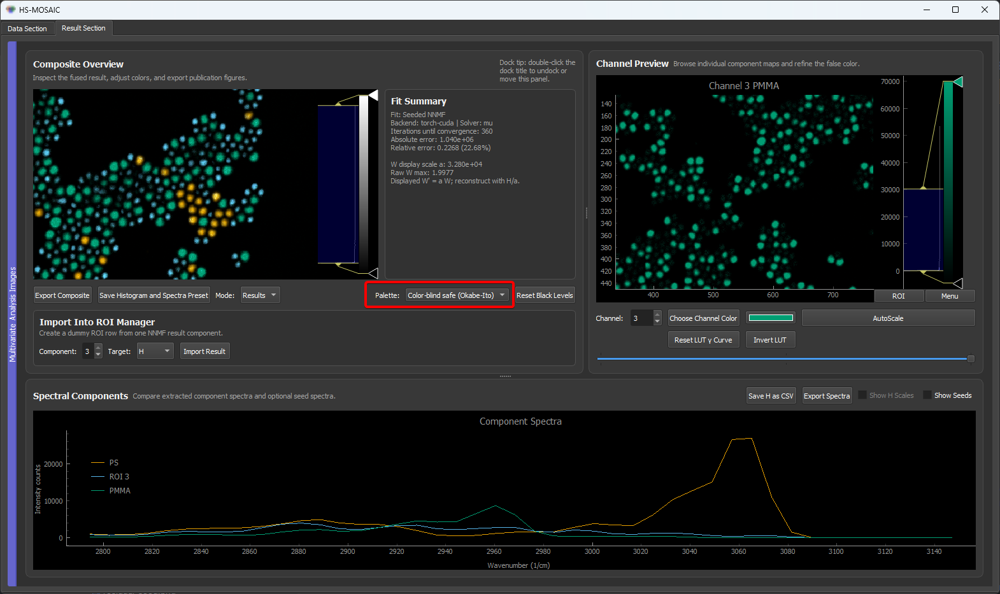

# 05 Results And Export

The result viewer shows the output of PCA, NNMF, or fixed-H NNLS. It combines the spatial component maps, spectra, colormaps, labels, and export tools.

For general pyqtgraph interaction, histogram/LUT adjustment, zooming, and plot export behavior, see [GUI and pyqtgraph basics](00_gui_and_pyqtgraph_basics.md). For publication-style spectral plots, see [Publication plots with Matplotlib rc defaults](00a_publication_plots_matplotlibrc.md).

## Composite Overview

The composite image fuses component maps into a false-color overview. This is usually the most important result for visual interpretation.

Each component uses a color shared with the ROI manager. Changing the component color updates the composite and the corresponding spectral line.

### Default colour palette

Since v0.9.3, new sessions use the **Magenta–Cyan–Yellow** palette as the default for components 1–3, with five supplementary colours filling slots 4–8. The magenta + cyan + yellow trio gives the highest mutual contrast on a black composite background of any three-colour combination, each of the three additive secondaries lights up two of three RGB primaries, so the three colours are simultaneously bright AND maximally separated in additive-mixing space.



*The **Palette** dropdown shown above is bidirectionally synced via the shared component-colour manager. Switching one updates the other instantly, and the choice is saved into the application JSON preset.*

Four palettes ship out of the box:

| Palette | When to use |
|---|---|
| **Magenta–Cyan–Yellow (max contrast)** — default | General use, particularly for additive composites on dark backgrounds. Highest three-way contrast of any built-in palette. |
| **High contrast (magenta–green, composite-optimised)** | When you specifically want the magenta + green colocalisation signal (the classic two-colour fluorescence overlay → white) to pop. Also colour-blind aware. |
| **Color-blind safe (Okabe-Ito)** | Publication figures aimed at a mixed audience where colour-vision deficiency is a concern. Designed for protanopia and deuteranopia (Wong, *Nat. Methods* **8**, 441 (2011)). Slightly less vivid on dark backgrounds than the two above. |
| **Classic RGB (legacy)** | Backwards compatibility with HS-MOSAIC ≤ 0.9.2 and audiences who specifically expect component 1 = red, 2 = green, 3 = blue. Not colour-blind safe. |

To switch palette, use the **Palette** dropdown in the result-viewer toolbar (next to **Save Histogram and Spectra Preset**) or the matching dropdown in the **ROI Manager** (next to **Load Lookup Table and Spectra Preset**). Both selectors share the same underlying state — changing one updates the other automatically. The selection is saved with the application JSON preset (`Save Preset`) and restored on load.

Per-component colour picks made through the colour buttons in the ROI Manager always override the palette default, so existing analyses that explicitly chose colours are unaffected when the palette is switched.

### Customising palette colours

When you modify any component colour with the colour-picker buttons in the ROI Manager (or via a preset that loaded explicit colours), the **Palette** dropdown reflects this by appending **`(customized)`** to the current entry — for example *"Magenta–Cyan–Yellow (max contrast) (customized)"*. This is a visual indicator that the visible colour set has diverged from the palette's canonical baseline.

The custom colours themselves are preserved across `Save Preset` / `Load Preset`: the preset stores both the palette name and every per-component colour explicitly. When the preset is reloaded:

1. The palette is applied first (sets all components to the palette baseline).
2. The per-component colours from the preset are then applied on top (restoring any explicit overrides).
3. The dropdown automatically re-detects that colours have diverged from the baseline and re-shows `(customized)`.

To restore the palette baseline (i.e. undo all per-component edits in one go), simply re-select the same palette in the dropdown — re-applying a palette resets every slot to its baseline value and clears the `(customized)` tag.

### Adding a custom palette

The palette registry is a plain Python dictionary in `hs_mosaic/widgets/color_manager.py`. Adding a new palette is a two-line edit — your palette then appears in both **Palette** dropdowns automatically, gets persisted in the application JSON preset, and round-trips through preset save/load like the built-in ones.

Open `hs_mosaic/widgets/color_manager.py` and add an entry to the two top-level dicts:

```python
# 1. Define the colours (any number; the GUI cycles through them for
#    components beyond the palette length).
PALETTES: dict[str, list[str]] = {
    "okabe_ito":   [ ... ],   # existing entry
    "classic_rgb": [ ... ],   # existing entry
    "my_lab_colors": [        # <-- your new palette
        "#1f77b4",
        "#ff7f0e",
        "#2ca02c",
        "#d62728",
        "#9467bd",
    ],
}

# 2. Give it a display label for the GUI dropdown.
PALETTE_LABELS: dict[str, str] = {
    "okabe_ito":     "Color-blind safe (Okabe-Ito)",
    "classic_rgb":   "Classic RGB (legacy)",
    "my_lab_colors": "My lab colours",   # <-- new label
}
```

Restart HS-MOSAIC and **My lab colours** is in both palette dropdowns. Selecting it sets components 1–N to the listed hex colours, and `Save Preset` records `"palette_name": "my_lab_colors"` in the JSON so the choice survives across sessions and across machines that have the same `color_manager.py`.

Notes:

- Colour specs accept hex strings (`"#1f77b4"`), Qt named colours (`"orange"`), or RGB tuples — anything `QColor` can parse.
- If you want your custom palette to be the default for new sessions on your machine, also change `DEFAULT_PALETTE = "my_lab_colors"` near the top of the same file.
- Custom palettes do not need a code release — you can ship them as a small patch of `color_manager.py` to collaborators, or maintain a fork.

## Channel Preview

The channel preview shows one component map at a time. Use it to inspect individual W maps, adjust color, and check whether a component is spatially meaningful.

Controls include:

- component/channel selector,
- color selector,
- autoscale,
- histogram/level controls,
- z/time result selector for 4D outputs.

Histogram levels control display contrast only. For exact reproducible min/max display values, save or edit the histogram state in a preset as described in [GUI and pyqtgraph basics](00_gui_and_pyqtgraph_basics.md).

For 4D results, the result viewer can browse the outer z/time axis.

> GIF placeholder: browsing channels and changing component color.

## Composite Projection In The Raw Image Viewer

The **Projection** dropdown above the raw image viewer has an entry called **Composite (from analysis)**. When this mode is selected, the raw viewer displays the false-colour composite produced by the result viewer. The display is kept in sync with the result viewer: any change of component colour, gradient, channel level, or 4D slice index on the result side is reflected on the raw side without a manual refresh.


### Use cases

- **Verification against the input data.** Switching the dropdown between **None** (raw stack) and **Composite (from analysis)** places the composite and the raw channels in the same viewport. This is useful for checking whether structures in the composite have corresponding signal in the underlying spectral channels, or whether they were introduced or amplified by the unmixing step.
- **Identification of unexpected structures.** Features that are not present in the seeded H basis can appear in the composite when residual-data analysis is used or when the chosen component count exceeds the number of seeded spectra. With the composite displayed in the raw viewer, the ROI Manager can be used to place a region of interest directly on such a feature. The mean spectrum of that region is then available as an H seed for a subsequent analysis run, supporting an iterative refinement of the spectral basis.
- **Detection of unrepresented features.** The reverse case is just as informative: a structure that is clearly present in the raw stack but appears **dark** in the mirrored composite is not explained by any of the current components. In a bead sample, for example, an individual bead that stays dark while its neighbours light up in their assigned colour indicates that no H seed in the current basis matches that bead's spectrum. The fix is the same iterative loop — place an ROI on the dark feature in the mirror, take its mean spectrum as a new H seed, increase the component count if needed, and re-run.

### Behaviour

- The mirror is updated whenever the result viewer recomputes its composite. Updates are triggered by colour changes, gradient or histogram-level changes, and 4D slice changes.
- If no analysis has been run, the cache is empty and the raw viewer remains on the raw image regardless of the dropdown selection. The mirror becomes active as soon as a composite is available.
- Switching to any other projection mode (**None**, **Average**, **Max**, **Min**) does not discard the cached composite, so returning to **Composite (from analysis)** does not require recomputation.
- The mirror shares the viewbox of the raw viewer, so the current pan and zoom state are preserved across projection changes.

In the example screenshot above, the ROI rectangles overlaid on the mirrored composite take on each component's display colour. When the colour of each box matches the dominant component inside it, the spectrally distinct objects have been assigned to separate components — a simple visual check on the seeded analysis.

For details on placing seeds derived from features identified in the mirrored composite, see [Seeds, spectra, and W maps](03_seeds_spectral_and_spatial.md).

## Result Data Types And W Scaling

The result viewer is primarily a visualization layer. It does not assume that every analysis result already fits into `uint16`.

### Why W can exceed 16-bit values

For NNMF and fixed-H NNLS, the spatial maps `W` are abundance coefficients. They are fitted numbers, not copies of the raw detector counts. Because of that, a valid `W` map can easily contain values above `65535` even if the original input TIFF was 16-bit.

This is especially common when:

- spectra are scaled in a particular way,
- one component carries much of the signal energy,
- fixed-H NNLS is used with strong or narrow spectral bases.

### Optional display scaling

Next to **Run Analysis**, the GUI provides the checkbox:

```text
Scale results to 16-bit
```

If this option is enabled, NNMF/NNLS result maps are scaled for display with one global factor over the full result array:

$$
a = \frac{65535}{\max(W)}
$$

and the result viewer shows:

$$
W' = aW
$$

This keeps all displayed components in a common 16-bit display range and preserves relative brightness between components inside that result.

If the option is disabled, the channel preview uses the raw floating-point `W` values instead.

### Important scope of this scaling

The `Scale results to 16-bit` option affects the displayed result maps in the result viewer. It is there to make viewing, histogram control, and export behavior more predictable.

The underlying analysis is still carried out in floating point. The fitted spectra `H` remain unchanged, and the GUI fit summary reports the display scale factor so you can see when a displayed `W` map is not in raw units anymore.

### Histograms and display levels

Histogram and LUT settings act on the data currently shown in the result viewer:

- if `Scale results to 16-bit` is enabled, they act on the scaled display map,
- if it is disabled, they act on the raw floating-point map.

Changing histogram levels changes only the visualization unless you explicitly export a rendered image.

## Spectral Components

The spectral plot shows the H spectra or PCA components. If seed spectra are available, they can be overlaid for comparison.

Use this plot to check:

- whether NNMF components remain similar to the seeds,
- whether fixed-H NNLS used the expected spectra,
- whether component labels and colors match the intended interpretation.

> Screenshot placeholder: spectral component plot with fitted H spectra, optional seed overlays, component labels, and color-matched result channels.

### H seed scales

If **Normalize H spectra to unity** was enabled during seed building, the result metadata can store the original per-component H maxima. These values are the scale factors used to turn the original seed spectra into max=1 spectra before W reconstruction and analysis.

Use **Show H Scales** in the result viewer to show these values in the fit summary. The checkbox is enabled only when the current result contains `h_seed_unity_scale_factors` metadata.

For fixed-H NNLS, these scale factors help interpret the coefficient maps: a normalized fixed spectrum gives `W` coefficients relative to a max=1 basis. For seeded NNMF, the factors describe the seed convention, but the final fit can still rescale `W` and `H` during optimization.

For 4D results, the displayed H scale list follows the selected z/time slice. In fast 4D NNMF/NNLS hybrid mode, the later slices use the fitted reference-slice `H` from NNMF, so initial seed scale factors may not be present for those NNLS slices.

## Save Histogram And Spectra Preset

!!! important "Main feature for reproducibility across fields of view"
    The **Save Histogram and Spectra Preset** button in the result viewer writes a `.preset` file that captures the current display state and the spectra in use. It is the recommended way to apply a finalised analysis to a series of FOVs of the same sample without rebuilding ROIs, colours, or display levels each time.


Use this once you are satisfied with an analysis on a representative FOV — for example the multi-bead mixture used in the synthetic quickstart — and want to replay the same display and spectral basis on neighbouring FOVs or on a new sample acquired with the same settings.

### What the `.preset` stores

| Saved | Notes |
|---|---|
| Component colours and LUTs | One colour per component, applied to composite, channel view, and exported maps. |
| Histogram / contrast levels per component | The min/max display levels and gradient state for each component, including the composite-level limits. |
| Spectra (H rows) | Either the fitted result spectra or the seed spectra, depending on the **Mode** dropdown next to the button (`Results` or `Seeds`). |
| Spectral axis at save time | The axis values associated with the saved spectra, used for resampling on load. |
| Component labels | The labels currently shown in the ROI manager and result viewer. |

### What it does not store

- Analysis settings (solver, backend, iteration limits, fixed-H mode, normalize-H toggle) — these live in the main JSON application preset.
- ROI geometry, physical units, 4D slice index, or preprocessing choices — same reason.
- The raw image data.

If a full session needs to be reproduced, save **both** the `.preset` (for the result-side display and spectra) and the main JSON preset via **Save Preset** in the analysis panel. See [Reference: Presets](../reference/presets.md) for the full field-by-field breakdown.

### How to load it

The `.preset` is loaded from the ROI Manager via the **Load Lookup Table and Spectra Preset** button. The GUI then asks how it should be applied:

- **LUTs Only** — apply the saved colours and histogram levels to the current components without touching the ROI list. Use this when the current ROIs are already correct and only the visual style should match a previous session.
- **LUTs + ROIs** — also import the saved spectra as **dummy ROI rows**. The imported spectra are loaded as **fixed seeds**: they do not depend on any drawn region in the current image, and they enter the seed pipeline as ready-made H rows. This is the route to reuse a finalised spectral basis on a new FOV.

When the saved spectral axis differs from the axis of the currently loaded dataset, the spectra are **interpolated** onto the current axis. Channels of the new axis that fall outside the saved range are filled by **extrapolation** of the nearest stored value. This is what allows the same `.preset` to be reused across acquisitions with slightly different spectral windows.

For the button and the load dialog in the ROI Manager, see [ROI Manager: Load Lookup Table and Spectra Preset](03b_roi_manager.md#load-lookup-table-and-spectra-preset). For the broader reproducibility context including the main JSON preset, see [Presets and reproducibility](06_presets_and_reproducibility.md).

## Saving Spectra

Use **Save H as CSV** to export spectral components. The CSV export uses the current spectral axis or custom labels.

This is useful for:

- plotting spectra externally,
- comparing components between datasets,
- documenting the final H matrix used in a paper.

Example output with a numerical spectral axis:

```csv
Wavenumber (1/cm),Component 0,Component 1,Component 2
2800.0,0.02,0.10,0.00
2850.0,1.00,0.25,0.05
2900.0,0.40,0.90,0.12
2950.0,0.10,1.00,0.20
```

Example output with custom channel labels:

```csv
Channel Label,Component 0,Component 1,Component 2
DAPI,1.00,0.10,0.00
GFP,0.05,0.95,0.20
mCherry,0.00,0.25,1.00
```

The component columns follow the component order in the result. Rename components in the ROI manager before export if the exported files should carry publication-ready labels elsewhere in the workflow.

Use **Export Spectra** to export the visible spectral plot as PNG or PDF. PNG export can use a transparent background. The export keeps the plot aspect ratio to avoid distorted text.

> Screenshot placeholder: **Export Spectra** dialog showing PNG/PDF choice, maximum size fields, and transparent-background option.

## Saving Composite TIFFs

Use **Export Composite** to export a Fiji/ImageJ-compatible TIFF or a rendered PNG.

The exporter stores:

- component image data,
- LUT colors,
- display ranges,
- component labels,
- physical pixel size where available,
- hyperstack axes for 4D result series.

For 4D outputs, the full z/time result stack is exported rather than only the currently displayed slice.

PNG export saves the currently rendered composite image at the result image resolution and can optionally add a scale bar.

### Data type notes for export

- Spectral CSV export writes numerical text values and does not quantize the spectra to `uint16`.
- Rendered PNG export writes the displayed RGB composite, not the raw component stack.
- Fiji/ImageJ TIFF export writes integer image data together with LUTs, ranges, labels, and pixel-size metadata.

If the exported result stack is already in the viewer's `uint16` working range, it is written as such. If a floating-point result stack is passed to the Fiji exporter, it is normalized to the saver dtype before writing. In other words, TIFF export is a visualization/export format step, not a guarantee that the saved TIFF preserves raw floating-point abundance values one-to-one.

For publication workflows, it is therefore useful to save:

- the preset,
- the exported TIFF,
- the exported H spectra CSV,
- and, if relevant, a short note on whether `Scale results to 16-bit` was enabled.

> GIF placeholder: exporting a composite TIFF and opening it in Fiji.

## Component Labels

Component labels from the ROI manager are propagated to the result viewer and to Fiji/ImageJ export metadata. This makes exported files easier to interpret later.

> Screenshot placeholder: result viewer with renamed components, final colors, adjusted histogram levels, and visible export controls.

Before exporting, check that:

- component labels are meaningful,
- colors are final,
- histogram ranges are set,
- scale bars/physical units are correct.

## Importing Results Back As Seeds

NNMF result components can be imported back into the ROI manager as H, W, or H+W seed rows. This supports iterative workflows where a first analysis provides seeds for a later run.
This can be useful for refining random NNMF results to refine later NNLS or NNMF iterations.
