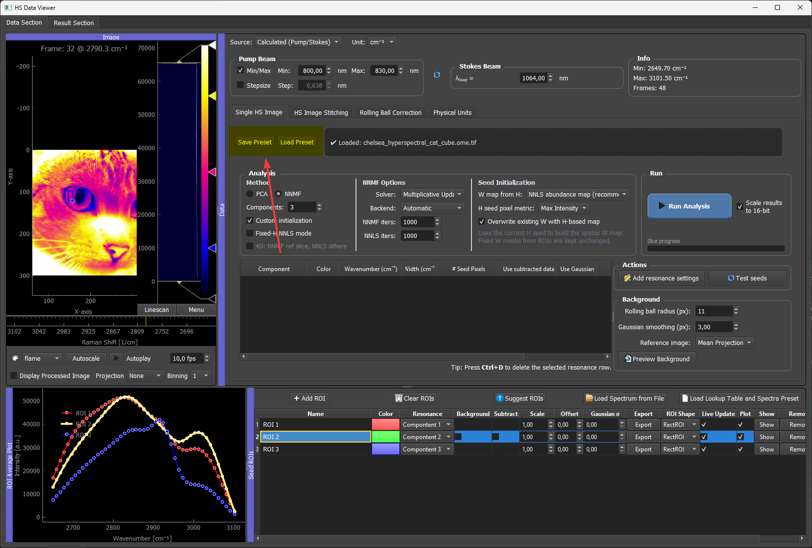
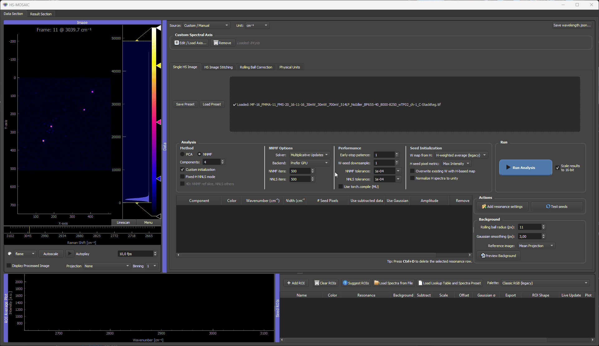

# 06 Presets And Reproducibility

Presets are used to save analysis state and make workflows reproducible. They are important when the same seed set, lookup tables, labels, and settings should be applied to another field of view or included with a publication.

## Main JSON Preset

The main GUI preset stores the analysis session state.

It includes:

- image path,
- binning factor,
- current 4D slice index,
- physical field of view and unit,
- spectral-axis widget state,
- derived wavenumbers/wavelengths,
- number of components,
- analysis method,
- custom initialization setting,
- NNMF solver and backend choice,
- NNMF and NNLS iteration limits,
- seed initialization settings,
- the **Normalize H spectra to unity** checkbox state,
- resonance/spectral settings,
- stitching settings,
- ROI manager state,
- histogram and LUT state,
- component labels.

This preset is the best option for reproducing a full GUI analysis.



Use **Save Preset** in the analysis/data area to write the main analysis settings JSON file. Use **Load Preset** to restore the saved setup later. Save the preset after the spectral axis, analysis settings, ROI rows, component labels, colors, and histogram levels are in the state you want to reproduce.

## Example Preset Structure

Preset files are meant to be written by the GUI. They can be inspected in a text editor, but manual editing should be limited to simple, intentional changes.

A shortened preset looks like this:

```json
{
  "image_path": "C:/data/example_stack.tif",
  "binning_factor": 1,
  "current_slice_index": 0,
  "fov": [512.0, 512.0],
  "unit": "um",
  "wavenumber_widget": {
    "source_index": 1,
    "spectral_unit": "nm",
    "custom_values": [500.0, 550.0, 600.0],
    "custom_labels": ["Dye A", "Dye B", "Dye C"]
  },
  "wavenumbers": [500.0, 550.0, 600.0],
  "num_components": 3,
  "analysis_method": "Fixed-H NNLS",
  "nnmf_solver": "mu",
  "nnmf_backend": "gpu",
  "performance_settings": {
    "w_seed_downsample_factor": 4,
    "torch_nmf_patience": 1,
    "torch_nmf_use_compile": false,
    "torch_nmf_tol": 1e-4,
    "torch_nnls_tol": 1e-4
  },
  "seed_init_settings": {
    "w_seed_mode": "NNLS abundance map",
    "overwrite_existing_w_from_h": true,
    "normalize_h_to_unity": true,
    "seed_pixel_metric": "Max Intensity"
  },
  "stitch_manager": {
    "pattern": "*.tif",
    "binning": 1,
    "overlap_row_raw": 180,
    "overlap_col_raw": 180
  },
  "roi_manager": {
    "rois": []
  },
  "labels": {
    "0": "Dye A",
    "1": "Dye B",
    "2": "Dye C"
  }
}
```

The real preset usually contains more ROI, color, histogram, seed, and solver state. The exact content depends on the current GUI state when the preset is saved.

The `normalize_h_to_unity` entry restores the **Normalize H spectra to unity** checkbox. Save a new preset after changing this checkbox if the run should be reproduced with the same H-seed scaling behavior.

## ROI And Seed State

Presets can include:

- drawn ROIs,
- dummy ROIs,
- loaded spectra,
- Gaussian seed rows,
- fixed W seeds,
- imported result seeds,
- component assignments.

This is important because the seed setup is often the scientific decision that defines the analysis.

## LUTs And Display Settings

The preset also stores display information such as LUT colors, histogram ranges, and labels. This helps reproduce the same visual output after reopening the data.

For figure preparation, save the preset after finalizing:

- labels,
- colors,
- black/white levels,
- component count,
- seed choices,
- analysis mode.

## Result-Viewer Presets

The result viewer can also save `.preset` files for seeds or results. These are useful for transferring H spectra, colors, and display ranges, but the main JSON preset is more complete for reproducing a whole analysis session.

The `.preset` workflow is designed for two use cases:

- transfer result spectra into the ROI Manager as dummy seed rows,
- reuse the same LUT colors and histogram settings on another result without changing the ROI list.

When a `.preset` is loaded from the ROI Manager, the GUI asks how it should be applied:

- `LUTs Only`: reuse the saved component colors and histogram/LUT settings for the current components.
- `LUTs + ROIs`: also import the saved spectra as dummy ROI rows.

This is useful when a representative field of view has already been styled carefully for figure preparation and the same display settings should be reused elsewhere.

The `.preset` file stores:

- component colors,
- histogram/contrast settings for each component,
- saved H spectra,
- spectral axis values stored with the preset.

It does not replace the full JSON application preset because it does not capture the entire GUI state, ROI geometry, physical units, 4D slice selection, solver settings, or all preprocessing choices.




*Loading a result-viewer `.preset` from the ROI Manager. The saved component colors and histogram/LUT levels are applied to the current components and their spectra are loaded.*

## Reusing A Preset On Another Field Of View

A typical reuse workflow is:

1. Analyze a representative field of view.
2. Save the preset.
3. Load a related field of view.
4. Load the preset.
5. Check component count and spectral-axis compatibility.
6. Run fixed-H NNLS or seeded NNMF.
7. Save the new result.

If the new dataset has a different number of spectral channels, check the spectral-axis warning carefully before continuing.

## Publication Recommendation

!!! important "What to archive for a reproducible publication"
    For a paper, the minimal reproducibility bundle is **(1) the input TIFF (or a representative crop), (2) the main JSON preset, (3) the exported result TIFF + H spectra CSV, and (4) the exact HS-MOSAIC release tag or commit hash you ran**. The first three together let a reader rerun the analysis; the version tag pins the algorithmic behavior. Archive them so the analysis stays inspectable even after future GUI versions change defaults.

For a paper, provide:

- the input data or representative cropped data,
- the preset file,
- the expected exported result,
- a short tutorial showing how to reproduce the result.

This makes the analysis inspectable and repeatable.
